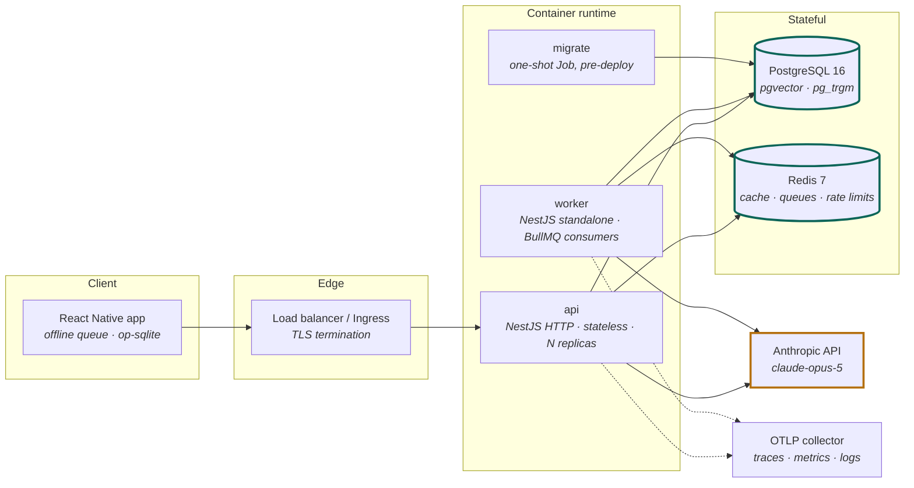
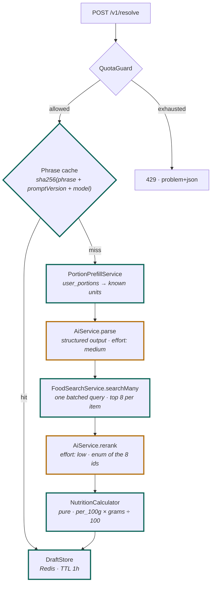
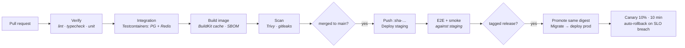

# Backend Technical Design — NutriCheck API

| | |
|---|---|
| **Status** | **Implemented and running.** M0 and M1 complete; the resolver (M2) is live |
| **Version** | 2.1 — reconciled with the built system, 2026-08-26 |
| **Owners** | Backend |
| **Runtime** | NestJS 11 · Node 22 LTS · TypeScript 5.x |
| **AI** | Pluggable: Anthropic, or any OpenAI-compatible provider (ADR-008) |
| **Verified** | 131 tests · 29 routes · live resolves at $0.000385 each |
| **Datastores** | PostgreSQL 16 (`pgvector`, `pg_trgm`) · Redis 7 |
| **Packaging** | OCI image, multi-stage build, non-root, distro-slim |
| **Related** | [PLAN.md](./PLAN.md) · [USER-FLOWS.md](./USER-FLOWS.md) |

Published version: <https://claude.ai/code/artifact/e885a1d3-5af5-4531-8c4d-c8da4f661bb9>

---

## Contents

0. [What is built](#0-what-is-built)
1. [Scope and non-goals](#1-scope-and-non-goals)
2. [System architecture](#2-system-architecture)
3. [Technology decisions (ADRs)](#3-technology-decisions-adrs)
4. [Application structure](#4-application-structure)
5. [API contract](#5-api-contract)
6. [Domain: the resolver](#6-domain-the-resolver)
7. [AI integration layer](#7-ai-integration-layer)
8. [Persistence](#8-persistence)
9. [Search subsystem](#9-search-subsystem)
10. [Asynchronous processing](#10-asynchronous-processing)
11. [Cross-cutting concerns](#11-cross-cutting-concerns)
12. [Security](#12-security)
13. [Containerization](#13-containerization)
14. [Environments and delivery](#14-environments-and-delivery)
15. [Testing strategy](#15-testing-strategy)
16. [Operations](#16-operations)
17. [Delivery plan](#17-delivery-plan)
18. [Open items](#18-open-items)

---

## 0. What is built

This document was written before the code and has been reconciled with it. Where
the two disagreed, the code won and the text was corrected — the corrections are
marked **[built]** and are worth more than the original prose, because each one
came from something that did not survive contact with a real system.

| Area | State |
|---|---|
| Workspace, Docker, migrations, health probes, error envelope | Built |
| Auth — **email + password only** (social deferred, see §18) | Built |
| Corpus ingestion, trigram search, custom foods | Built |
| Goals, log commit, entry edit, saved meals, repeat strip | Built |
| **The resolver** — parse, candidate search, re-rank, arithmetic, SSE | **Built and exercised against a live model** |
| **The corpus-free path** — `/v1/ai-meal` (§7.7) | **Built.** Reads a whole sentence with no corpus search. The one place a model supplies nutrition |
| Post-meal insight — `/v1/insights/meal` | Built. Facts computed in Postgres; the model only writes prose about them |
| `identify()` + `ai_food_matches` — model-proposed name mappings | Built, not routed (§7.7) |
| Embeddings + RRF fusion | Not built. Search is trigram-only; `food_embeddings` is empty |
| Eval harness | Not built — the largest remaining gap (§15.4) |
| CI pipeline | Not built |
| Server-side speech transcription | Not built, and see §7.6 before building it |

### What the first live calls changed

The pipeline passed 91 scripted tests before it ever reached a real model, and
the first four live phrases still found three defects. All three were about
trusting something: two about trusting the model's output shape, one about
trusting a comment that described work never done.

1. `count` and `standard_measure` never resolved to grams. The code carried a
   comment saying they were "filled in below" and nothing below filled them in,
   so "two rotis" found its food and produced no amount and no nutrients.
2. The re-rank returned one pick for two items and the second item silently
   vanished, breaking the rule the prompt itself states. A missing pick now
   falls back to the top candidate at low confidence — a row the user can fix
   beats an item that disappeared.
3. "an apple" parsed as `none_given`, so the app asked for an amount it had
   already been given.

The lesson is recorded here rather than in a commit message because it
generalises: **a scripted test asserts the contract you imagined; only a real
model tells you which parts of that contract it declines to honour.** Both
model-trust defects are now regression-tested with a deliberately misbehaving
fake.

---

## 1. Scope and non-goals

### 1.1 In scope

The HTTP API and worker processes backing the mobile client: identity, food corpus, search, the AI resolver, log persistence, goals, insights, and the operational surface (quotas, cost accounting, evals).

### 1.2 Non-goals

| Excluded | Rationale |
|---|---|
| Object storage | Nothing user-generated is large. Returns with photo capture |
| Vision / multimodal ingest | Photo capture is parked (PLAN §1) |
| Public/partner API | Single first-party client. No API keys, no partner rate tiers |
| Multi-region active-active | Single region until scale justifies the operational cost |
| Server-side rendering / web app | Mobile only in v1 |

### 1.3 Quality attributes, ranked

1. **Correctness of nutrition arithmetic** — a wrong number is unrecoverable trust damage.
2. **Idempotent writes** — the client is offline-first and replays.
3. **Latency on `/v1/resolve`** — p95 ≤ 3 s or the parsing route loses to manual search.
4. **Cost predictability** — the AI proxy is a spend surface exposed to authenticated users.
5. **Deployability** — a fix reaching production in under an hour, repeatably.

---

## 2. System architecture

### 2.1 Container view



`api`, `worker` and `migrate` are **the same image** with different entrypoints. One build artifact, one scan, one provenance record — three commands.

### 2.2 Deployment topology

| Component | Replicas | Scaling signal | Notes |
|---|---:|---|---|
| `api` | 2 → 10 | CPU + request concurrency | Stateless. Rolling update, `maxUnavailable: 0` |
| `worker` | 1 → 4 | Queue depth | Separate HPA — a corpus ingest must not evict API capacity |
| `migrate` | — | — | Kubernetes `Job` / ECS one-off, gated before the rollout |
| PostgreSQL | managed | — | PITR enabled, read replica deferred to M3 |
| Redis | managed | — | AOF on. Queue durability matters; cache loss does not |

### 2.3 Request classes

The API serves three workloads with materially different profiles. They share a process but are isolated by rate limiter, timeout, and circuit breaker.

| Class | Routes | p95 target | External dependency |
|---|---|---:|---|
| **Interactive read** | search, day view, recents | 150 ms | Postgres only |
| **Interactive write** | log commit, profile, goals | 200 ms | Postgres only |
| **AI-backed** | `/v1/resolve` | 3 s | Anthropic |

Only the third can fail because of a third party. Its failures degrade to the first two by design (USER-FLOWS §8), which is why the resolver is a separate module with its own timeout and breaker rather than an inline branch.

---

## 3. Technology decisions (ADRs)

Condensed records. Each states the decision, the alternative, and the trigger that would reverse it.

### ADR-001 — NestJS with the Fastify adapter

**Decision.** NestJS 11 on `@nestjs/platform-fastify`.

**Why.** The service has a real module boundary problem: eleven feature areas, cross-cutting auth/quota/telemetry, and two entrypoints sharing a domain layer. Nest's DI container and module graph make that structure enforced rather than conventional, and its ecosystem (`@nestjs/terminus`, `@nestjs/throttler`, `@nestjs/bullmq`, `@nestjs/swagger`) covers most of §11 without bespoke code. The Fastify adapter keeps the throughput characteristics that motivated Fastify in v1 — roughly 2× Express on JSON — so the framework choice costs no measurable latency.

**Alternative rejected.** Bare Fastify (v1 of this document). Faster to start, but every cross-cutting concern becomes a hand-rolled plugin, and the DI-less structure degrades as the module count grows.

**Reversal trigger.** Nest's abstraction fighting the Fastify adapter on a load-bearing feature — SSE is the one to validate early (§5.4).

### ADR-002 — Drizzle ORM, not Prisma or TypeORM

**Decision.** Drizzle ORM with `drizzle-kit` migrations, wrapped in a Nest `DatabaseModule` provider.

**Why.** `pgvector` is load-bearing here, and Drizzle has first-class support: a `vector()` column type, `cosineDistance()` in the query builder, and HNSW index definitions in the schema. Prisma models a vector column as `Unsupported("vector")`, which excludes it from the generated client and pushes every similarity query into `$queryRaw` — losing exactly the type safety Prisma is chosen for. Drizzle also composes cleanly with the raw SQL that §9's RRF fusion requires.

**Alternative rejected.** Prisma (better DX, worse pgvector story), TypeORM (Nest's historical default, declining maintenance velocity, decorator-based schema drifts from migrations).

**Reversal trigger.** pgvector operations moving behind a dedicated vector store, at which point Prisma's ergonomics win.

### ADR-003 — Zod as the single contract source

**Decision.** Zod schemas in `packages/contracts`, surfaced as Nest DTOs by a ~60-line in-repo `createZodDto` + `ZodValidationPipe`, as OpenAPI via `@nestjs/swagger` + `zod-to-json-schema`, and as inferred TypeScript types in the React Native client.

**Why.** One definition produces runtime validation, the OpenAPI document, and the client's compile-time types. The alternative — `class-validator` DTOs plus a hand-kept mobile interface — has two sources of truth for the same wire format, and they drift silently. It also means the same Zod object that validates a request body can define an Anthropic structured-output format (§7.2).

**Alternative rejected.** `class-validator` + `class-transformer`, the Nest default — better decorator ergonomics, no path to a shared client type. Also `nestjs-zod`, dropped during implementation: it adds a version-matrix risk across Nest / Zod / Swagger majors for code we would still have to wrap, and owning the pipe lets validation failures map straight onto the RFC 9457 envelope in §5.2 rather than translating another library's exception shape.

**Implementation note.** `zodToJsonSchema` is called through a locally narrowed function type. Its generic parameter makes the checker walk the entire schema and hit TS2589 (`Type instantiation is excessively deep`) on any non-trivial contract; only the runtime value is needed.

### ADR-004 — Single image, three entrypoints

**Decision.** One Dockerfile producing one image; `api`, `worker`, and `migrate` differ only by command.

**Why.** One SBOM, one vulnerability scan, one digest to promote through environments. Divergence between an API image and a worker image built from the same commit is a class of bug that simply cannot occur.

**Alternative rejected.** Per-role images (smaller worker image, three build pipelines, three scan surfaces).

### ADR-005 — In-process embeddings, not an embeddings API

**Decision.** `bge-small-en-v1.5` (384-dim) via `onnxruntime-node`, model weights baked into the image at build time.

**Why.** Every search request needs a query vector. A hosted embeddings API puts a per-call cost and a network hop on the most frequent operation in the product — the same reasoning that made PLAN §5 self-host the corpus. In-process inference is ~5 ms on CPU, has no failure mode, and works offline in CI.

**Consequence.** The image carries ~130 MB of model weights, and the model version is effectively part of the schema: changing it invalidates every stored vector and requires a full backfill. Pin it in `packages/database` and treat a bump as a migration.

### ADR-006 — Redis for cache, queues, and rate limits

**Decision.** One Redis, three logical uses, separate key prefixes and separate databases where the eviction policy differs.

**Consequence.** Cache keys are evictable (`allkeys-lru`); queue keys are not. If they share a database, a cache flood evicts jobs. Use **db 0 for BullMQ (no eviction) and db 1 for cache**, or two instances if the managed provider makes per-db policy impossible.

### ADR-007 — Turborepo + npm workspaces

**Decision.** npm workspaces for dependency resolution, Turborepo for task orchestration and remote caching.

**Why.** Metro (React Native) resolves modules by walking `node_modules` and has a long history of failing against pnpm's symlinked store. npm's hoisted layout avoids the class of problem entirely. Turborepo adds the build graph and cache without changing the module layout.

**Reversal trigger.** The mobile app leaving the monorepo, after which pnpm is strictly better for the server side.

---

### ADR-008 — The AI provider is pluggable  **[built]**

**Decision.** `AiService` is an abstract class. `AnthropicService` and
`OpenAiCompatibleService` implement it; `AI_PROVIDER` selects one at wiring time.
The OpenAI-compatible implementation reaches any host speaking that wire format
— OpenAI, Groq, Together, OpenRouter, DeepSeek, Fireworks, vLLM, Ollama — via
`AI_BASE_URL`.

**Why it was almost free.** The boundary already existed for testability: the
resolver depends on the abstract class so the pipeline can be exercised without
a network. Making the vendor swappable turned out to be a second implementation
of an interface that was already there, and no code downstream of it changed.
That is the return on sealing a dependency behind an interface before you have a
second reason to.

**What does not transfer, and matters.** Prompt caching is the load-bearing
assumption in §7.4's cost model, and it is not portable. Anthropic caches at an
explicit `cache_control` breakpoint and bills reads at 0.1×; OpenAI caches
automatically, only above a 1024-token prefix, and bills at a discount. Observed
live: the re-rank prompt (~825 tokens) never cached on OpenAI at all. The two
also *report* it differently — OpenAI counts cached tokens **inside**
`prompt_tokens` where Anthropic reports them separately, so the adapter
subtracts rather than double-counting. A provider swap changes the economics,
not just the client.

**The guarantees survive the swap** because they are properties of the schemas,
not the vendor: the parse schema has no nutrient field, and the re-rank schema
is a per-request enum of real row ids. `json_schema` strict mode is what makes
the second one binding, so `AI_STRICT_SCHEMA` is opt-**out**: disabling it for a
provider without strict mode gives up the guarantee that a food cannot be
invented, and that should be a deliberate act.

---

## 4. Application structure

### 4.1 Repository layout

```
.
├── apps/
│   ├── api/                    NestJS service (HTTP + worker entrypoints)
│   └── mobile/                 React Native app (moved from ./nutricheck)
├── packages/
│   ├── contracts/              Zod schemas — the wire contract, shared
│   ├── database/               Drizzle schema, migrations, seed
│   ├── prompts/                Prompt text, content-hash versioned
│   └── eval/                   Eval harness (§15.4)
├── tools/
│   └── ingest/                 USDA / OFF ingestion CLIs
├── docker/
│   ├── Dockerfile
│   ├── docker-compose.yml      Local development
│   └── docker-compose.ci.yml   CI service dependencies
├── deploy/
│   ├── k8s/                    Manifests / Helm chart
│   └── migrations.job.yaml
├── .github/workflows/
├── turbo.json
└── package.json                workspaces: apps/*, packages/*, tools/*
```

### 4.2 Service internals

```
apps/api/src/
├── main.ts                     HTTP bootstrap
├── worker.ts                   Standalone bootstrap — BullMQ consumers only
├── tracing.ts                  OTel SDK — MUST be imported before anything else
├── app.module.ts
│
├── config/
│   ├── config.schema.ts        Zod-validated env, fails fast at boot
│   └── config.module.ts
│
├── common/
│   ├── filters/                AllExceptionsFilter → RFC 9457
│   ├── interceptors/           Timeout, response shaping, metrics
│   ├── guards/                 JwtAuthGuard, QuotaGuard, ThrottlerGuard
│   ├── decorators/             @CurrentUser, @Public, @Idempotent
│   └── pipes/                  ZodValidationPipe (global)
│
├── infrastructure/
│   ├── database/               Drizzle provider, transaction helper, health indicator
│   ├── redis/                  ioredis provider, health indicator
│   ├── queue/                  BullMQ registration, shared job options
│   ├── telemetry/              Metrics registry, tracer helpers
│   └── embeddings/             ONNX session, warm-up, EmbeddingService
│
└── modules/
    ├── auth/                   Providers, token issue/rotate, JWKS verification
    ├── users/                  Profile
    ├── goals/                  Mifflin–St Jeor, append-only goal rows
    ├── foods/                  Corpus reads, search, custom foods, barcode
    ├── resolver/               Orchestration — the pipeline in §6
    ├── ai/                     Anthropic client, prompts, cost accounting
    ├── logs/                   Commit, idempotency, day queries
    ├── meals/                  Saved meals and phrases
    ├── suggestions/            Recents / frequents ranking
    ├── ideas/                  Food suggestions against the day's remaining targets
    ├── quota/                  Token buckets, spend ceilings
    ├── insights/               Day/week aggregates, weight
    └── ops/                    ai_runs, match_misses, ai_food_matches
```

**Dependency rule, enforced by ESLint boundaries:** `modules/*` may import `common` and `infrastructure`; `infrastructure` may import `common`; nothing imports `modules/*` across feature boundaries except through an exported service. `resolver` composes `ai`, `foods`, and `quota` — it is the only module permitted to depend on three others, and that is the reason it exists as a module rather than a service inside `logs`.

**`ai` is a sealed boundary.** `@anthropic-ai/sdk` is importable from `modules/ai/**` only, enforced by a lint rule. Nothing else in the codebase knows which model is in use.

### 4.3 Bootstrap

```ts
// apps/api/src/main.ts
import './tracing';                      // must precede every other import

async function bootstrap() {
  const app = await NestFactory.create<NestFastifyApplication>(
    AppModule,
    new FastifyAdapter({ trustProxy: true, bodyLimit: 256 * 1024 }),
    { bufferLogs: true },
  );

  app.useLogger(app.get(Logger));                    // nestjs-pino
  app.enableVersioning({ type: VersioningType.URI, defaultVersion: '1' });
  app.useGlobalPipes(new ZodValidationPipe());
  app.useGlobalFilters(new AllExceptionsFilter());
  app.enableShutdownHooks();                          // SIGTERM → drain

  await app.register(helmet);
  await app.listen({ port: config.PORT, host: '0.0.0.0' });
}
```

`host: '0.0.0.0'` is not optional in a container — Node's default binds loopback and the container answers nothing.

---

## 5. API contract

### 5.1 Conventions

| Concern | Decision |
|---|---|
| Versioning | URI, `/v1/...`, via `enableVersioning` |
| Content type | `application/json`; `text/event-stream` on the resolver |
| Errors | RFC 9457 `application/problem+json` |
| Auth | `Authorization: Bearer <access JWT>` |
| Correlation | `x-request-id` in and out; propagated to logs and traces |
| Idempotency | Domain-level via `client_id` on writes (§8.4), not a header |
| Pagination | Cursor-based (`?cursor=&limit=`), opaque cursors |
| Timestamps | RFC 3339 UTC; client sends its own `logged_at` with offset |
| Documentation | OpenAPI 3.1 generated from Zod, served at `/docs` in non-prod |

### 5.2 Error envelope

```json
{
  "type": "https://api.nutricheck.app/problems/quota-exhausted",
  "title": "AI resolve quota exhausted",
  "status": 429,
  "detail": "Daily resolve limit reached. Search and repeat remain available.",
  "instance": "/v1/resolve",
  "requestId": "01JQ...",
  "resetAt": "2026-08-26T00:00:00Z"
}
```

One filter produces this for every thrown error. Nest `HttpException`s map by status; Zod failures map to 422 with a `violations[]` array; anything unrecognized becomes a 500 with the message replaced and the stack logged, never serialized.

### 5.3 Endpoints

| Method | Path | Class | Notes |
|---|---|---|---|
| `POST` | `/v1/auth/register` | write | Email + password. 5/hour per IP |
| `POST` | `/v1/auth/login` | write | 10 / 15 min per IP |
| `POST` | `/v1/auth/refresh` | write | Rotating refresh, reuse detection |
| `POST` | `/v1/auth/google` | write | Sign in, sign up and link, from one verified Google ID token. 60 / 10 min per IP. **503 when `GOOGLE_OAUTH_CLIENT_IDS` is unset** — the app falls back to email + password. Links to an existing password account only on a Google-verified address |
| `POST` | `/v1/auth/logout` | write | Revoke the refresh family. Idempotent |
| `POST` | `/v1/auth/change-password` | write | Revokes every session on every device |
| `GET` | `/v1/me` | read | The signed-in user |
| `GET`&nbsp;`PUT` | `/v1/me/profile` | read/write | |
| `GET`&nbsp;`POST` | `/v1/me/goals` | read/write | POST appends; never updates in place |
| `GET`&nbsp;`POST` | `/v1/me/weight` | read/write | `?days=` bounds the chart only — the latest and earliest readings come back whatever window is asked. POST upserts on (user, local day), so re-posting corrects that day rather than adding to it. Recording the NEWEST reading also writes `user_profiles.weight_kg` and appends a recomputed goal, in one transaction; backfilling an older one does neither |
| `DELETE` | `/v1/me/weight/:date` | write | Removes one reading. **409 when it is the only one** — every account has a current weight and the goals are derived from it. Deleting the NEWEST reading promotes the one before it onto `user_profiles.weight_kg` and recomputes the goal; deleting an older one touches neither. Returns the remaining series, not 204 |
| `GET`&nbsp;`POST` | `/v1/me/fasting` | read/write | Declared fasts — an explicit start, end and target, never inferred from the log. `?limit=` bounds the LIST only; the record (longest, average, on-target) is all-time. **POST 409s when a fast is already running** — at most one open fast per user, enforced by a partial unique index on `(user_id) WHERE ended_at IS NULL`, not by a check-then-insert. `startedAt` may be backdated up to 72 h. Returns the whole summary, never the row |
| `PATCH` | `/v1/me/fasting/current` | write | Extends the target or corrects the start of the RUNNING fast, keeping the time already served. 404 when nothing is running, 422 on an empty body |
| `POST` | `/v1/me/fasting/current/end` | write | Ends it. `endedAt` defaults to now and may be backdated to any instant after the start. 404 when nothing is running — **including on a resend**, which is deliberate: the update is guarded by `ended_at IS NULL` so a double tap cannot overwrite an end time the user has already seen |
| `DELETE` | `/v1/me/fasting/:id` | write | Throws one away — the running one or a finished one, which are one operation because from the user's side they are one thing. No "last one" rule, unlike weight: nothing is derived from a fast, so an empty history is an ordinary state. Returns the remaining summary, not 204 |
| `GET` | `/v1/foods/search` | read | `?q=&limit=` — no model in the path |
| `GET` | `/v1/foods/:id` | read | Nutrients + household portions |
| `GET` | `/v1/foods/barcode/:gtin` | read | Conditional on the barcode decision |
| `POST` | `/v1/foods/custom` | write | |
| `POST` | **`/v1/resolve`** | **AI** | Returns a draft. Writes nothing to the log |
| `POST` | **`/v1/ai-meal`** | **AI** | Reads a whole sentence, no corpus search. Estimates, marked as such (§7.7) |
| `POST` | `/v1/resolve/:draftId/items/:itemId` | AI | Re-resolve one item |
| `POST` | `/v1/logs` | write | Idempotent on `client_id` |
| `POST` | `/v1/logs/batch` | write | Offline drain, per-element results |
| `GET`&nbsp;`PATCH`&nbsp;`DELETE` | `/v1/logs/:id` | read/write | |
| `GET` | `/v1/logs?date=` | read | Day view, goal-in-effect resolved server-side |
| `GET` | `/v1/logs/month` | read | `?date=&tz=` — every day of that calendar month, logged or not. Backs the history calendar |
| `GET` | `/v1/suggestions/recents` | read | frequency × recency × time-of-day |
| `GET`&nbsp;`POST` | `/v1/meals` | read/write | Saved meals and phrases |
| `GET` | `/v1/quota` | read | Remaining resolves, reset time |
| `GET` | **`/v1/ideas`** | **AI** | `?date=&tz=` — foods that fit what is left of the day. Estimates, marked as such (§7.7) |
| `GET` | `/v1/insights/{day,week}` | read | M3 |
| `POST` | `/v1/weight` | write | M3 |
| `GET` | `/health/live` `/health/ready` | — | Unauthenticated, excluded from telemetry |
| `GET` | `/metrics` | — | Prometheus, bound to the internal listener only |

**`/v1/ideas` is the third route where a model produces nutrition**, after
`/v1/ai-meal` and `/v1/me/goals/suggest`, and it is the one with the weakest
justification: it fires because a tab was opened rather than because somebody
asked a question. Four things bound it, and they are in `IdeasService` in that
order — the gap is computed server-side from the same day view the Today screen
renders; every returned item is Atwater-checked against its own macros and
DROPPED if it fails; the model returns per-100g rates and the multiplication
stays in our code; and every row it creates is written `source: 'ai'`, owned by
the user, with all nutrient states `imputed`.

It is also the only AI route deliberately **without** `QuotaGuard`. The guard
runs before the handler and therefore before the cache, so an exhausted user
would be refused a list they had already been shown and already paid for. The
service checks the same quota itself, after the cache lookup and before the
call — the only ordering where the ceiling bounds spend without also bounding
what the user is allowed to look at.

**The subject is the person, not the day.** `ideasToUserTurn` puts the profile
and the goal first and today's figures last, and the prompt says outright that
the day is a constraint on the answer rather than the answer. That ordering was
a correction: the first version led with the remaining targets and produced a
gap-filling calculator — it answered "what closes today's arithmetic", which is
not a question anyone opens an app to ask, and on a day with nothing logged it
had no subject at all. Sections are weighted roughly by the order they are read
in, so the order IS the instruction.

**The transport must not swallow this route's failures.** `getMealInsight` on
the client does swallow its own, correctly: a meal card that loses its note
still has every number on it. The ideas response IS its screen, so a swallowed
failure renders as a confident wrong explanation. A 404 from an unrestarted
server reached a device as "a model was not reachable" once, and that is why
`IdeasScreen` now classifies the failure and names it.

**The critical split: `/v1/resolve` never writes a log.** It returns a draft; `POST /v1/logs` commits. This makes "never auto-commit a parse" (USER-FLOWS §7) a property of the API rather than client discipline, and it lets an offline commit replay without re-invoking the model.

### 5.4 Server-sent events on the resolver

USER-FLOWS §5 requires skeleton rows that fill in, not a spinner. `/v1/resolve` streams:

| Event | Emitted at | Payload |
|---|---:|---|
| `parsed` | ~800 ms | Item names and quantities — enough to label the skeleton |
| `resolved` | ~1.5 s | Full items: food, nutrients, candidates, confidence |
| `done` | — | `draftId`, `aiRunId`, timings |
| `error` | any | Problem document; client maps to a USER-FLOWS §8 row |

Implemented with Nest's `@Sse()` decorator returning an `Observable<MessageEvent>`. Content negotiation on `Accept: application/json` returns the same draft as a single response — the eval harness and integration tests use that path, and both paths must produce a byte-identical draft.

> **Validate this in week one.** `@Sse()` is supported on the Fastify adapter, but SSE through a proxy chain has more ways to fail than any other route shape: buffering at the ingress, an idle timeout shorter than the stream, HTTP/2 differences, compression middleware holding the first chunk. Write the integration test *and* run it through a staging ingress before the resolver depends on it. Fallback if the adapter fights: write to `reply.raw` directly from a controller marked `@Header('Content-Type', 'text/event-stream')`. Set `X-Accel-Buffering: no` and disable compression on this route regardless.

---

## 6. Domain: the resolver

### 6.1 Pipeline



`ResolverService` orchestrates; every box is an injected collaborator with its own interface, which is what makes the pipeline unit-testable without a network.

### 6.2 Latency budget

| Stage | p50 | p95 | Notes |
|---|---:|---:|---|
| Guard + cache probe | 5 ms | 15 ms | Redis round trip |
| Portion prefill | 15 ms | 40 ms | One indexed read |
| Parse call | 800 ms | 1600 ms | Anthropic, `effort: medium` |
| Candidate search | 40 ms | 90 ms | **One** query for all items (§9.3) |
| Re-rank call | 600 ms | 1200 ms | Anthropic, `effort: low` |
| Arithmetic + persist | 20 ms | 45 ms | |
| **Total** | **~1.5 s** | **~3.0 s** | Two model calls dominate |

Route timeout 8 s, enforced by a `TimeoutInterceptor` scoped to the module. Beyond that the client is better served by the search fallback than by waiting.

### 6.3 The draft contract

Defined once in `packages/contracts`. Every confirm-sheet state in USER-FLOWS §7 is a branch on a field here; if the sheet needs a state this cannot express, the contract is wrong.

```ts
export const QuantityType = z.enum([
  'exact_mass', 'count', 'standard_measure', 'personal_unit', 'none_given',
]);

export const ResolvedItem = z.object({
  itemId: z.string().uuid(),
  matchedText: z.string(),
  quantity: z.object({
    type: QuantityType,
    raw: z.string(),
    grams: z.number().positive().nullable(),
    source: z.enum(['stated', 'food_portion', 'user_portion', 'unknown']),
    range: z.tuple([z.number(), z.number()]).nullable(),
  }),
  food: z.object({ id: z.string(), name: z.string(), brand: z.string().nullable() }).nullable(),
  candidates: z.array(z.object({
    id: z.string(), name: z.string(), kcalPer100g: z.number(),
  })).max(8),
  confidence: z.enum(['high', 'low']),
  nutrients: z.object({
    kcal: z.number(),
    proteinG: z.number(),
    fiberG: z.number().nullable(),
    fiberState: z.enum(['known', 'imputed', 'unknown']),
  }).nullable(),
});

export const ResolveDraft = z.object({
  draftId: z.string().uuid(),
  phrase: z.string(),                       // verbatim — the reproducible input
  source: z.enum(['text', 'voice', 'search', 'repeat']),
  items: z.array(ResolvedItem),
  unresolved: z.array(z.object({ text: z.string() })),
  aiRunId: z.string().uuid(),
});
export type ResolveDraft = z.infer<typeof ResolveDraft>;
```

Three invariants, asserted in `NutritionCalculator` and covered by unit tests:

| Invariant | Enforcement |
|---|---|
| `grams: null` is never replaced by a default | `none_given` short-circuits before any fallback; no `?? 100` exists in the module |
| `range` is non-null **only** for an unlearned `personal_unit` | Refinement on the Zod schema — an invalid combination fails serialization |
| `fiberG: null` + `fiberState: 'unknown'` ≠ `0` | No `??` or `\|\|` coalescing on fiber anywhere; lint rule on the field name |

### 6.4 Failure handling

| Condition | HTTP | `type` slug | Client lands on |
|---|---:|---|---|
| Upstream timeout after one retry | 504 | `resolver-timeout` | Search, phrase pre-filled |
| Parse returned zero items | 200 | — | Search, phrase pre-filled (not an error) |
| Subset unmatched | 200 | — | Confirm sheet, partially filled |
| `stop_reason: "refusal"` | 502 | `resolver-refused` | Search |
| Circuit breaker open | 503 | `resolver-unavailable` | Search, immediately — no 8 s wait |
| Quota exhausted | 429 | `quota-exhausted` | Search and repeat, both unaffected |

**Circuit breaker.** The Anthropic client sits behind an `opossum` breaker: 50% failure rate over a 30 s rolling window trips it for 30 s. Without it, an upstream outage turns every resolve into an 8 s timeout and exhausts the request pool — the failure mode where a degraded dependency takes the healthy routes down with it.

---

## 7. AI integration layer

### 7.1 Client configuration

| Setting | Value | Rationale |
|---|---|---|
| Model | `claude-opus-5` | $5 / $25 per MTok |
| Thinking | `{ type: 'adaptive' }` | Default-on for Opus 5; the parse benefits |
| Effort | `medium` (parse) · `low` (re-rank) | The re-rank is a constrained pick from eight rows |
| Structured output | `output_config.format` via `messages.parse()` | Validated at the SDK boundary |
| `max_tokens` | 4096 | Both outputs are small; non-streaming is appropriate |
| Refusal fallback | `fallbacks: 'default'` + beta `server-side-fallback-2026-07-01` | A policy decline otherwise just stops |
| SDK timeout / retries | 8000 ms · `maxRetries: 1` | Route budget is 8 s; a third attempt is worse than failing over |

The two calls are deliberately **not** merged. The constrained pick is what makes an invented food unrepresentable (PLAN §2), and it requires the candidate ids to be in the prompt — which requires fetching them first.

### 7.2 Structured outputs

The same Zod objects that define the contract define the output format — one definition, validated by the SDK.

```ts
// modules/ai/schemas/parse.schema.ts
export const ParseResult = z.object({
  items: z.array(z.object({
    matchedText: z.string(),
    foodPhrase: z.string(),
    quantityType: QuantityType,
    quantityValue: z.number().nullable(),
    quantityUnit: z.string().nullable(),
  })),
  unresolved: z.array(z.string()),
});

const res = await this.client.messages.parse({
  model: 'claude-opus-5',
  max_tokens: 4096,
  output_config: { format: zodOutputFormat(ParseResult), effort: 'medium' },
  system: [{ type: 'text', text: TAXONOMY_PROMPT, cache_control: { type: 'ephemeral' } }],
  messages: [{ role: 'user', content: userTurn }],
});
if (!res.parsed_output) throw new ParseFailedError(res.stop_reason);
```

**One gotcha, on the OpenAI-compatible side.** `json_schema` with
`strict: true` is what makes the candidate-id enum a guarantee rather than a
request, but strict mode also rejects schemas it cannot read — it does not
degrade. `zod-to-json-schema` targeting `openApi3` renders `.positive()` the
draft-4 way, `{ minimum: 0, exclusiveMinimum: true }`, and structured outputs
wants draft 2020-12, where `exclusiveMinimum` is the bound rather than a flag.
The result is `400 Invalid schema: True is not of type number` for every call
using that schema. `tighten()` normalises it alongside `additionalProperties`
and `required`; a single `.positive()` anywhere in a new schema is otherwise a
dead route.

The re-rank enum is constructed per request from the eight ids Postgres returned, so an off-list answer is not expressible:

```ts
const RerankResult = z.object({
  picks: z.array(z.object({
    itemIndex: z.number().int(),
    foodId: z.enum(candidateIds as [string, ...string[]]),
    confidence: z.enum(['high', 'low']),
  })),
});
```

### 7.3 Prompt caching

The taxonomy system prefix is byte-identical on every request and renders first — the shape prompt caching wants.

- `cache_control: { type: 'ephemeral' }` on the **last system block**; nothing variable after it.
- Opus 5's minimum cacheable prefix is **512 tokens**. The ~1–1.5 k taxonomy prompt clears it comfortably (it was 1024 on Opus 4.8).
- Reads cost 0.1×, writes 1.25× at the default 5-minute TTL; break-even is two requests. Stay on 5 minutes — the 1-hour TTL doubles the write and needs three reads to pay off, which only helps with traffic gaps longer than five minutes.
- Prompts are files in `packages/prompts`, exported with a build-time content hash as `promptVersion`. A prompt edit is a version bump, an eval run, and a cache rebuild — in that order.

> **The invalidator that will actually happen.** The `user_portions` prefill is per-user. It must go **after** the breakpoint, in the user turn — never interpolated into the system prompt. Getting that backwards silently makes the cache per-user and roughly triples the bill with no error and no test failure. Guard it with an assertion in `PromptBuilder` that the system string contains no user-scoped tokens, and alert on the cache-hit ratio (§16.2).

### 7.4 Cost — measured, not estimated  **[built]**

What the running system actually bills, against the original `claude-opus-5` estimate:

| | Estimated (Opus 5) | **Measured (gpt-4o-mini)** |
|---|---:|---:|
| Parse | ~$0.0047 | $0.000240 |
| Re-rank | ~$0.0059 | $0.000165 |
| **Per resolve** | **~$0.011** | **$0.000385** |
| Latency | ~1.5 s p50 target | ~2.2 s per call |
| Cache reads | assumed most of input | **zero** |

Two things the estimate got wrong, both worth keeping.

**The cached prefix did not cache.** Every live call reported
`cache_read_tokens: 0`. OpenAI's automatic caching needs a ≥1024-token prefix
and the re-rank prompt is ~825, so it never engages; the parse prompt is ~1096
and caches only on a repeat inside the window. The `ai_cache_hit_ratio` alarm in
§16.2 therefore reads zero on this provider — **expected here, not a silent
invalidator** — so that alarm needs a per-provider threshold or it will cry wolf.

**A 30× cheaper model turns cost into a quality question.** At $0.000385 the AI
is no longer worth optimising for price. On a live three-item phrase the re-rank
chose the battered-fried chicken entry over plain breast — the ~140 kcal
confusion PLAN §2 predicts — but marked itself `confidence: low`, so the sheet
surfaces the alternatives. The safety mechanism worked; the ranking did not.
Whether a mini model is good enough for the constrained pick is exactly what
§15.4's eval harness exists to answer with a number, which makes it the
highest-value unbuilt thing in this document.

### 7.4.1 The original estimate

Every call writes an `ai_runs` row inside the same transaction as the draft persist. Token counts come from `response.usage`; cost is computed from a rate table versioned alongside the model id, never hardcoded at the call site.

Per resolve, at list price, prefix cached:

| Component | Tokens | Cost |
|---|---:|---:|
| Parse — cached system prefix | ~1.2 k read | $0.0006 |
| Parse — user turn | ~50 | $0.0003 |
| Parse — output | ~150 | $0.0038 |
| Re-rank — cached system prefix | ~800 read | $0.0004 |
| **Re-rank — candidate rows** | **~600 uncached** | **$0.0030** |
| Re-rank — output | ~100 | $0.0025 |
| **Total** | | **≈ $0.011** |

Inside PLAN §7's $0.010–0.015 band, and it locates the optimization: **the candidate list is the largest uncached input and cannot be cached** — it differs per query by construction. Serialize each candidate as `id`, short display name, and kcal per 100 g only; not the full description, brand chain, or portion table. Cutting a row from ~75 to ~40 tokens saves ~$0.0015 per log, which exceeds the entire parse-side prefix cost.

Re-measure with `client.messages.countTokens()` against the real prompts before any of this sets a quota.

### 7.5 Voice: on-device first, then server-side  **[built — reversed 2026-08-26]**

The backend performs **no speech recognition** and has no audio endpoint. Sent
`Content-Type: audio/wav`, `/v1/resolve` returns **415**.

That is the design, not a gap. USER-FLOWS §5: voice is not a separate flow, it
is dictation into the same text field. The device transcribes; the backend
receives the string typing would have produced and runs the identical pipeline.
`source: 'voice'` is accepted and stored on `log_entries` — a label recording
how an entry was made, for the miss log and analytics, not a processing mode.

It is also why voice cost the backend nothing and the parked photo route will
not: a photo cannot be turned into text on the device.

**Decided, 2026-08-26 — and the decision went the other way.** The paragraph
above ended "decide it deliberately rather than drifting into it". It was
decided deliberately: server-side transcription is **built**, and it is no
longer a fallback — it is the only path.

The forcing argument was measured, not theoretical. Android's offline models
could not carry the language this app is actually spoken in: `en-IN` renders
Tanglish phonetically at best, and `ta-IN` needs a language pack most phones do
not have and **no Android API can query**. The failure was silent in both
directions, on the one input the product depends on.

What that bought, and what it cost:

- **`POST /v1/transcribe`** — the only route that accepts audio. Gemini
  transcribes; the response is **text, never a draft**.
- `/v1/resolve` **still returns 415** for audio. That separation is the point:
  transcription answers "is this what I said", resolution answers "is this what
  I ate", and folding them together would remove the step where a bad transcript
  is fixed by typing rather than by re-recording.
- The privacy position named above **did change**, and the docs it affects should
  say so. Audio leaves the device. It is never written to disk server-side, and
  the clip is deleted on the phone before the upload call resolves — but
  "needs no microphone" was already false the moment dictation shipped, and
  "audio never leaves the phone" is false now.
- Dictation now needs the network, and takes ~5 s rather than being instant.

### 7.6 The phrase cache

Redis, keyed `resolve:v1:{sha256(normalizedPhrase + promptVersion + model)}`, TTL 24 h. Re-typed phrases — which correlate strongly with re-eaten meals — cost nothing. Cache hits still write an `ai_runs` row with `cached: true` so eval sampling and cost dashboards stay honest.


### 7.7 The corpus-free path  **[built 2026-08-27]**

`POST /v1/ai-meal` hands a whole sentence to the model and takes back foods with
nutrition, without searching the corpus at all. It is the deliberate exception
to the rule the rest of this section enforces, and it should be read as one.

**Why it exists.** The corpus holds 13,440 foods and 25 Tamil aliases. A
sentence like *"naa innaike rendu muttai and 5 dosai and chutney saapten"* has
almost no chance of matching: `pavakkai` finds nothing however good the trigram
scoring is, because USDA files bitter gourd under "Balsam-pear". Search-first
therefore dead-ends on the words this app's users actually say, and a dead end
is worse for them than an estimate they can see is an estimate.

**What keeps the exception bounded.** Three properties, none of which make an
estimate correct — they make it visible, and keep it out of everybody else's
data:

1. **Rates, not totals.** The model returns per-100 g values and a gram weight;
   the multiplication happens in `scaleToPortion`, extracted from the write path
   so it can be tested rather than reviewed. A model that multiplies 5 × 168
   wrong fails in a way unrelated to how well it knows dosai, and arithmetic is
   the one part of this we can do perfectly.
2. **Rows are marked and owned.** Written `source: 'ai'` — distinct from
   `'user'`, which is a food somebody typed the numbers into — with
   `created_by_user_id` set and every nutrient state `imputed`, never `known`.
   `known` is the word this schema uses for a value that came off a laboratory
   bench. The client renders `imputed` with a `~`.
3. **It does not replace `/v1/resolve`.** Both routes exist. Folding them
   together would make "did this number come from a measurement" depend on a
   branch rather than on which endpoint was called.

**Rows are created at interpret time, not on confirm**, because
`log_items.food_id` is `NOT NULL` and the client commits through the ordinary
`POST /v1/logs` path. A draft with nothing behind it would need a second commit
path that froze nutrients its own way, and two ways to write a log entry is
what §8.5 exists to prevent. Keyed on `(source, source_id)` with the user inside
the key, so saying "dosai" every morning reuses one row rather than
accumulating a hundred.

**Cost.** One call, `gpt-4o-mini`, measured at **$0.000256** per meal — 869
input and 209 output tokens. Recorded on `ai_runs` with `step: 'meal'` like
every other call, so it counts against `RESOLVE_USER_DAILY_SPEND_USD`. This is
now the primary path rather than a fallback, which makes that ceiling
load-bearing in a way it was not when it only covered `/v1/resolve`.

#### Two things adjacent to it, built but not routed

`identify()` translates an unmatched name into English search terms — the safe
half of the same problem. It sees no food id and no nutrient field, so what
comes back is fed to the ordinary search like any other query: a name for a food
we do not stock matches nothing. The model can fail to find a food; it cannot
invent one.

`ai_food_matches` is the quarantine for those mappings, deliberately **not**
`food_aliases`. That table is human-authored and is what search scores against;
mixing model output into it makes "who wrote this" unanswerable a month later
and a bad alias indistinguishable from a curated one. Unique on the normalized
phrase, so a name costs one model call once, ever — the second user asking hits
the row, not the provider. A null `food_id` is the valuable state, not the
failure one: the model understood the word and we genuinely do not stock the
food, which is the dish backlog arriving as data.


---

## 8. Persistence

### 8.1 Schema

```sql
-- corpus -----------------------------------------------------------------
foods            (id, source, source_id, name, brand, is_generic,
                  search_text, created_at)
food_nutrients   (food_id, kcal, protein_g,          -- never NULL, always reported
                  carbs_g   numeric NULL,             -- NULL ≠ 0
                  carbs_state fiber_state NOT NULL,   -- known|imputed|unknown
                  fat_g     numeric NULL,
                  fat_state fiber_state NOT NULL,
                  fiber_g   numeric NULL,
                  fiber_state fiber_state NOT NULL)
                  -- CHECK (state = 'unknown') = (value IS NULL) on each pair,
                  -- enforced in the database, not just in Zod.
                  -- Coverage is NOT symmetric: SR Legacy reports carbs and fat
                  -- for 100% of rows, fibre for 92.8%.
food_portions    (food_id, label, grams, is_default)
food_embeddings  (food_id, embedding vector(384))     -- generic corpus only

-- identity ---------------------------------------------------------------
users, user_profiles, auth_identities, refresh_tokens

-- targets ----------------------------------------------------------------
goals            (id, user_id, kcal, protein_g, carbs_g, fat_g, fiber_g,
                  effective_from, basis jsonb)  -- basis.fatPctOfKcal: the
                  -- carb/fat split is POLICY, so the share used is stored

-- personalization --------------------------------------------------------
user_portions    (user_id, unit_label, food_id NULL, grams, n_corrections)
user_phrases     (user_id, phrase, meal_id)
user_foods, recipes, meals, meal_items

-- logs -------------------------------------------------------------------
log_entries      (id, client_id, user_id, logged_at, meal,
                  source log_source,          -- text|voice|search|repeat|photo
                  phrase NULL, ai_run_id NULL, created_at)
log_items        (id, entry_id, food_id, grams,
                  kcal, protein_g,            -- FROZEN at commit
                  carbs_g NULL, carbs_state,  -- its own copy, not a join:
                  fat_g NULL, fat_state,      -- a USDA reissue must not
                  fiber_g NULL, fiber_state,  -- rewrite a Tuesday in March
                  quantity_type, quantity_source)

-- operations -------------------------------------------------------------
ai_runs          (id, user_id, prompt_version, model, step, input_hash, cached,
                  input_tokens, cache_read_tokens, output_tokens,
                  cost_usd, latency_ms, stop_reason, response jsonb, created_at)
match_misses     (id, user_id, phrase, item_text, resolved_to NULL, created_at)
ai_food_matches  (id, phrase UNIQUE, suggestions jsonb, food_id NULL, model,
                  prompt_version, confirmations, rejections, status, timestamps)
                  -- quarantine for model-proposed name mappings. NOT
                  -- food_aliases: that table is human-authored and is what
                  -- search scores against. See 7.7.
```

### 8.2 Indexes

| Index | Table | Purpose |
|---|---|---|
| `GIN (search_text gin_trgm_ops)` | `foods` | Trigram branch of §9 |
| `HNSW (embedding vector_cosine_ops)` | `food_embeddings` | Vector branch. `m=16, ef_construction=64` |
| `UNIQUE (user_id, client_id)` | `log_entries` | Idempotency (§8.4) |
| `(user_id, logged_at DESC)` | `log_entries` | Day view, recents |
| `UNIQUE (source, source_id)` | `foods` | Ingest upsert key |
| `(user_id, effective_from DESC)` | `goals` | Goal-in-effect resolution |
| `(user_id, created_at DESC)` | `ai_runs` | Cost attribution, quota audit |
| `(created_at)` BRIN | `ai_runs` | Retention pruning on a large append-only table |

### 8.3 Schema invariants

**`log_source` includes `'photo'` from the first migration.** Nothing writes it. An unused enum value costs nothing; `ALTER TYPE` on a hot enum in production is not free.

**`fiber_state` is `NOT NULL` on both tables.** Nullable invites a coalesce in a serializer, and a day's denominator is then quietly wrong. Every write site must state which of the three cases applies.

**`log_items` freezes nutrients.** Not denormalization for speed — correctness. USDA reissues data, you will re-ingest, and computed history would silently rewrite a Tuesday in March.

**`goals` is append-only** with `effective_from`. A day view resolves the goal in effect on that date, never the current one.

### 8.4 Idempotency

The device generates a UUIDv7 `client_id` at the moment the user taps commit — before any network call — and persists it with the queued entry in op-sqlite.

```
POST /v1/logs  { clientId, loggedAt, meal, source, phrase?, draftId?, items[] }
  → 201  entry created
  → 200  entry already exists for (userId, clientId) — returns the original
```

`UNIQUE (user_id, client_id)` makes this safe under concurrency: the insert is attempted, and a unique violation is caught and converted to a read. A `SELECT`-then-`INSERT` check has a race window; the constraint does not.

`POST /v1/logs/batch` applies the same semantics per element and returns per-element results, so one bad entry in a drained queue does not fail the other eleven.

### 8.5 Commit semantics

**The server recomputes nutrients; the client's numbers are never trusted.** The request carries `foodId` and `grams`; kcal, protein, carbs, fat and fibre are recalculated from `food_nutrients` and frozen. The client's copy exists for optimistic rendering only. This keeps the arithmetic single-sourced when a log is committed weeks after its draft expired.

A commit carrying a `draftId` also writes the learning signal, **inside the same transaction**: portion edits upsert `user_portions`, food swaps write `match_misses` with `resolved_to` set. In a separate request these are the writes that get lost, and they are the ones that make the product improve with use.

### 8.6 Migrations

`drizzle-kit` generates SQL migrations, committed to the repo and reviewed like code. They run as a **pre-deploy Job**, never on application boot — two replicas booting concurrently would race.

| Rule | Reason |
|---|---|
| Expand → migrate → contract, across releases | A rollback must not hit a column the old code cannot read |
| No `DROP COLUMN` in the same release that stops writing it | One release of overlap minimum |
| `CREATE INDEX CONCURRENTLY` on populated tables | A plain `CREATE INDEX` takes an `ACCESS EXCLUSIVE` lock |
| `lock_timeout = '3s'` at the top of every migration | Fail fast rather than queue behind a long transaction and stall writes |
| Backfills are BullMQ jobs, not migrations | A migration that runs for 40 minutes blocks the deploy |

---

## 9. Search subsystem

### 9.1 Design

`FoodSearchService` serves both `/v1/foods/search` and stage 3 of the resolver — one code path, so search quality and resolver quality improve together.

**Hybrid retrieval fused by Reciprocal Rank Fusion.** Two rankings per query — `pg_trgm` similarity over `search_text`, and cosine distance over `food_embeddings` — combined as `Σ 1/(60 + rank)`. RRF over weighted score blending because it requires no per-corpus tuning constant and degrades gracefully when one branch returns nothing.

**Boosts, applied after fusion:** the user's custom foods, foods they have logged before, then generic rows over branded. The last is load-bearing — the branded corpus outnumbers the generic one roughly fifty to one, so without it "chicken thigh" surfaces a supermarket ready-meal.

### 9.2 Embedding scope

Only the generic corpus is embedded: Foundation, SR Legacy, FNDDS, and curated dishes — roughly 40 k rows, a ~60 MB HNSW index that stays resident. The ~2 M branded Open Food Facts rows are reached by barcode or near-exact brand name, which is a trigram query, not a semantic one. Embedding them would produce a multi-gigabyte index that slows every vector search to serve queries that never needed it.

This is what makes §6.2's 40 ms candidate search achievable.

### 9.3 Batched retrieval

The resolver passes all N item phrases in one call. A three-item meal issuing three round trips is 200 ms instead of 40 ms, and it compounds on the five-item meals that justify parsing in the first place.

```sql
SELECT q.idx, f.id, f.name, n.kcal
FROM unnest($1::text[], $2::vector[]) WITH ORDINALITY AS q(phrase, embedding, idx)
CROSS JOIN LATERAL (
  -- RRF over the trigram and vector rankings for this phrase
) AS f
JOIN food_nutrients n ON n.food_id = f.id;
```

### 9.4 Embedding service

`onnxruntime-node` holds a single warm session, created at module init and exercised with a dummy input so the first user request does not pay the JIT cost. Weights ship in the image (§13.2). Concurrency is bounded by a small queue — ONNX inference is CPU-bound and unbounded parallelism starves the event loop.

---

## 10. Asynchronous processing

BullMQ on Redis, consumed by the `worker` entrypoint. The API never processes jobs; it only enqueues.

| Queue | Trigger | Concurrency | Retry |
|---|---|---:|---|
| `corpus.ingest` | Manual / CI | 1 | 3, exponential |
| `corpus.embed` | After ingest | 4 | 3, exponential |
| `eval.nightly` | Cron 02:00 UTC | 1 | None — alert instead |
| `insights.weekly` | Cron Mon 06:00 local | 8 | 3 |
| `curation.digest` | Cron weekly | 1 | 3 |
| `retention.prune` | Cron daily | 1 | 3 |

Standard job options: `removeOnComplete: { age: 86400, count: 1000 }`, `removeOnFail: { age: 604800 }`. Without these Redis grows unbounded, which is the most common way a BullMQ deployment falls over.

**Every processor is idempotent.** BullMQ guarantees at-least-once delivery; a job that runs twice must produce the same state.

**Cron uses BullMQ repeatable jobs, not `@nestjs/schedule`.** With more than one replica, `@Cron` fires on every instance — a weekly summary sent N times. Repeatable jobs are claimed once from the shared queue.

---

## 11. Cross-cutting concerns

### 11.1 Configuration

`@nestjs/config` with a Zod schema; the process refuses to start on an invalid or missing variable. No `process.env` access outside `config/`.

```ts
export const configSchema = z.object({
  NODE_ENV: z.enum(['development', 'test', 'production']),
  PORT: z.coerce.number().default(3000),
  DATABASE_URL: z.string().url(),
  DATABASE_POOL_MAX: z.coerce.number().default(10),
  REDIS_URL: z.string().url(),
  ANTHROPIC_API_KEY: z.string().min(1),
  JWT_ACCESS_SECRET: z.string().min(32),
  JWT_REFRESH_SECRET: z.string().min(32),
  OTEL_EXPORTER_OTLP_ENDPOINT: z.string().url().optional(),
  RESOLVE_DAILY_QUOTA: z.coerce.number().default(50),
  LOG_LEVEL: z.enum(['trace','debug','info','warn','error']).default('info'),
});
```

**Pool sizing is a deployment constraint, not a preference.** `DATABASE_POOL_MAX × (api replicas + worker replicas)` must stay under the Postgres `max_connections` budget. At 10 replicas × 10 connections you are at 100 before the worker is counted — size the pool from the replica ceiling, or put PgBouncer in transaction mode in front.

### 11.2 Logging

`nestjs-pino`, JSON to stdout, one line per request. `genReqId` reads `x-request-id` or generates a UUIDv7. Trace and span ids are injected so a log line links to its trace.

Redaction is configured, not remembered: `authorization`, `set-cookie`, `req.body.password`, `req.body.idToken`, `*.apiKey`. **The user's meal phrase is health-adjacent personal data — it is logged at `debug` only, never at `info`.**

### 11.3 Telemetry

OpenTelemetry Node SDK, initialized in `tracing.ts` before any other import, exporting OTLP. Auto-instrumentation for HTTP, Fastify, `pg`, `ioredis`, and BullMQ; manual spans around the two Anthropic calls, the embedding inference, and the fusion query.

| Metric | Type | Labels |
|---|---|---|
| `http_request_duration_seconds` | histogram | route, method, status |
| `resolver_stage_duration_seconds` | histogram | stage |
| `resolver_outcome_total` | counter | outcome (`ok`, `partial`, `empty`, `timeout`, `refused`) |
| `ai_tokens_total` | counter | step, kind (`input`, `cache_read`, `output`) |
| `ai_cost_usd_total` | counter | step, model |
| `ai_cache_hit_ratio` | gauge | step |
| `search_duration_seconds` | histogram | branch (`trigram`, `vector`, `fusion`) |
| `queue_depth` | gauge | queue |

`ai_cost_usd_total` and `ai_cache_hit_ratio` are the two that pay for themselves — they turn "why did the bill move" from an investigation into a dashboard.

### 11.4 Health checks

`@nestjs/terminus`, and the distinction matters in Kubernetes:

| Endpoint | Checks | Failure means |
|---|---|---|
| `/health/live` | Event loop responsive | Restart the pod |
| `/health/ready` | Postgres `SELECT 1`, Redis `PING` | Remove from the load balancer; **do not restart** |
| `/health/startup` | Migrations applied, ONNX session warm | Still booting; withhold traffic |

A liveness probe that checks the database restarts every pod during a database blip, converting a degradation into an outage. Liveness checks the process; readiness checks the dependencies.

### 11.5 Graceful shutdown

`enableShutdownHooks()` plus a `preStop` sleep of 5 s. On SIGTERM: stop accepting connections, drain in-flight requests up to 15 s, close BullMQ workers after their current job, drain the Postgres pool, flush telemetry, exit. `terminationGracePeriodSeconds: 30`.

Without the `preStop` delay, the pod stops accepting before the ingress finishes removing it, and a slice of requests 502 on every deploy.

---

## 12. Security

| Control | Implementation |
|---|---|
| Transport | TLS at the ingress; HSTS; `trustProxy` set so client IPs are real |
| Headers | `@fastify/helmet` |
| CORS | Disabled — a native client sends no `Origin`. Enabled only for `/docs` in non-prod |
| Authentication | **Email + password only in this build.** Argon2id (m=19456, t=2, p=1) per the OWASP cheat sheet |
| Password policy | Length only — min 10, max 200. Composition rules push people to `Password1!`; NIST SP 800-63B advises against them. The maximum is a hashing-DoS guard |
| Account enumeration | One error for unknown-account and wrong-password, and a dummy Argon2 verify on the unknown path so timing matches |
| Access token | JWT, 15 min, `HS256` (asymmetric if a second consumer ever appears) |
| Refresh token | Opaque, 30 days, rotating, stored as a SHA-256 hash, **reuse detection revokes the family** |
| Authorization | `JwtAuthGuard` global; `@Public()` opts out. Every query is scoped by `userId` at the repository layer |
| Input validation | Global `ZodValidationPipe`; unknown keys stripped; 256 KB body limit |
| Rate limiting | `@nestjs/throttler` with Redis storage — per-IP on auth, per-user elsewhere |
| Quota | `QuotaGuard` on `/v1/resolve`; Redis token bucket; independent of throttling |
| Spend ceiling | Per-user daily `ai_runs.cost_usd` cap; alerts before it blocks |
| Secrets | Injected as env from the platform secret store. Never in the image, never in the repo |
| SQL injection | Parameterized throughout; raw SQL only via Drizzle's `sql` template |
| Container | Non-root UID 1001, read-only root filesystem, `no-new-privileges`, all capabilities dropped |
| Supply chain | `npm ci` from a committed lockfile; Trivy on image and filesystem; SBOM per build; Dependabot |
| PII | Meal phrases treated as health-adjacent: `debug`-level logging only, excluded from error reports, deleted with the account |

**Abuse surface.** The API key is the asset. Three controls, all of them necessary: a maximum phrase length (a 4,000-word "meal" is someone probing for a free model), per-user quota, and a per-user daily spend ceiling computed from actual token usage. A proxy without a spend ceiling is an open one.

**Account deletion** cascades to logs, drafts, `user_portions`, and `ai_runs` rows, and is exercised by an e2e test — a store requirement and a GDPR one.

---

## 13. Containerization

### 13.1 Dockerfile

```dockerfile
# syntax=docker/dockerfile:1.7
ARG NODE_VERSION=22.14.0

# ---- base -------------------------------------------------------------
FROM node:${NODE_VERSION}-bookworm-slim AS base
ENV PNPM_HOME=/dev/null NODE_ENV=production
WORKDIR /app
RUN apt-get update && apt-get install -y --no-install-recommends dumb-init \
 && rm -rf /var/lib/apt/lists/*

# ---- dependencies -----------------------------------------------------
FROM base AS deps
COPY package.json package-lock.json ./
COPY apps/api/package.json           apps/api/
COPY packages/contracts/package.json packages/contracts/
COPY packages/database/package.json  packages/database/
COPY packages/prompts/package.json   packages/prompts/
RUN --mount=type=cache,target=/root/.npm \
    npm ci --workspaces --include-workspace-root

# ---- build ------------------------------------------------------------
FROM deps AS build
COPY . .
RUN npx turbo run build --filter=@nutricheck/api...
RUN npm prune --omit=dev --workspaces --include-workspace-root

# ---- model weights ----------------------------------------------------
FROM base AS model
ARG MODEL_SHA256
ADD --checksum=sha256:${MODEL_SHA256} \
    https://huggingface.co/BAAI/bge-small-en-v1.5/resolve/main/onnx/model.onnx \
    /model/model.onnx
COPY packages/database/model/tokenizer.json /model/tokenizer.json

# ---- runtime ----------------------------------------------------------
FROM base AS runtime
RUN groupadd -g 1001 nodejs && useradd -u 1001 -g nodejs -m nodejs

COPY --from=build --chown=1001:1001 /app/node_modules          ./node_modules
COPY --from=build --chown=1001:1001 /app/apps/api/dist         ./apps/api/dist
COPY --from=build --chown=1001:1001 /app/packages              ./packages
COPY --from=model --chown=1001:1001 /model                     ./model

ENV MODEL_PATH=/app/model NODE_ENV=production
USER 1001
EXPOSE 3000
ENTRYPOINT ["dumb-init", "--"]
CMD ["node", "apps/api/dist/main.js"]
```

| Detail | Why it is there |
|---|---|
| `dumb-init` as PID 1 | Node as PID 1 does not reap zombies and handles SIGTERM inconsistently |
| Package manifests copied before source | The `npm ci` layer caches across source-only changes |
| `--mount=type=cache` on `/root/.npm` | Cold installs drop from minutes to seconds in CI |
| `--checksum` on the model `ADD` | The weights are a supply-chain input; an unpinned download is an unsigned dependency |
| Model in its own stage | Changing application code does not re-download 130 MB |
| Non-root `USER 1001` | Required for `runAsNonRoot`; a root container is a finding in any review |
| No `HEALTHCHECK` | The orchestrator probes over HTTP. A `curl` healthcheck would force a shell into the image |

`.dockerignore` excludes `node_modules`, `.git`, `apps/mobile`, `**/dist`, `**/*.test.ts`, `.env*`, `deploy/`. Without it the build context includes the React Native app and its Android build outputs.

### 13.2 Image policy

| Policy | Value |
|---|---|
| Base | `node:22-bookworm-slim`, digest-pinned, rebuilt weekly |
| Tags | `sha-<git-sha>` always; `v<semver>` on release. **Never deploy `latest`** |
| Size target | < 400 MB (~130 MB of it model weights) |
| Scanning | Trivy on every build; `HIGH`/`CRITICAL` with a fix available blocks the merge |
| Provenance | SLSA attestation + SBOM attached to the image |

`node:22-bookworm-slim` rather than Alpine: `onnxruntime-node` ships glibc prebuilds, and musl forces a source build with materially different numerical behaviour. Distroless was considered and rejected — no shell makes debugging a production container disproportionately painful for the marginal surface reduction, given the image already runs non-root with a read-only root filesystem.

### 13.3 Local development

```yaml
# docker/docker-compose.yml
name: nutricheck

services:
  postgres:
    image: pgvector/pgvector:pg16
    environment:
      POSTGRES_USER: nutricheck
      POSTGRES_PASSWORD: local
      POSTGRES_DB: nutricheck
    ports: ["5432:5432"]
    volumes:
      - pgdata:/var/lib/postgresql/data
      - ./initdb:/docker-entrypoint-initdb.d:ro   # CREATE EXTENSION vector, pg_trgm
    healthcheck:
      test: ["CMD-SHELL", "pg_isready -U nutricheck -d nutricheck"]
      interval: 5s
      timeout: 3s
      retries: 10

  redis:
    image: redis:7-alpine
    command: ["redis-server", "--appendonly", "yes"]
    ports: ["6379:6379"]
    volumes: [redisdata:/data]
    healthcheck:
      test: ["CMD", "redis-cli", "ping"]
      interval: 5s
      timeout: 3s
      retries: 10

  migrate:
    build: { context: .., dockerfile: docker/Dockerfile, target: runtime }
    command: ["node", "apps/api/dist/migrate.js"]
    env_file: [../.env.local]
    depends_on:
      postgres: { condition: service_healthy }

  api:
    build: { context: .., dockerfile: docker/Dockerfile, target: build }
    command: ["npm", "run", "start:dev", "-w", "@nutricheck/api"]
    env_file: [../.env.local]
    ports: ["3000:3000"]
    volumes:
      - ../apps/api/src:/app/apps/api/src:ro       # hot reload
      - ../packages:/app/packages:ro
    depends_on:
      postgres: { condition: service_healthy }
      redis:    { condition: service_healthy }
      migrate:  { condition: service_completed_successfully }

  worker:
    build: { context: .., dockerfile: docker/Dockerfile, target: build }
    command: ["npm", "run", "start:worker:dev", "-w", "@nutricheck/api"]
    env_file: [../.env.local]
    depends_on:
      migrate: { condition: service_completed_successfully }

volumes: { pgdata: {}, redisdata: {} }
```

`make dev` brings the stack up and seeds a ~5 k-row USDA subset. **Local runs the same Postgres image as production** — a SQLite shortcut would make the search subsystem, the part most worth testing, untestable.

### 13.4 Kubernetes

The manifests that are not boilerplate:

```yaml
spec:
  strategy:
    rollingUpdate: { maxUnavailable: 0, maxSurge: 1 }
  template:
    spec:
      securityContext:
        runAsNonRoot: true
        runAsUser: 1001
        seccompProfile: { type: RuntimeDefault }
      containers:
        - name: api
          image: ghcr.io/org/nutricheck-api@sha256:...   # digest, not tag
          securityContext:
            readOnlyRootFilesystem: true
            allowPrivilegeEscalation: false
            capabilities: { drop: ["ALL"] }
          resources:
            requests: { cpu: 250m, memory: 512Mi }
            limits:   { memory: 1Gi }                    # no CPU limit
          startupProbe:   { httpGet: { path: /health/startup, port: 3000 }, failureThreshold: 30, periodSeconds: 2 }
          readinessProbe: { httpGet: { path: /health/ready,   port: 3000 }, periodSeconds: 5 }
          livenessProbe:  { httpGet: { path: /health/live,    port: 3000 }, periodSeconds: 10 }
          lifecycle:
            preStop: { exec: { command: ["sleep", "5"] } }
      terminationGracePeriodSeconds: 30
```

**A memory limit but no CPU limit.** CPU limits cause throttling that shows up as unexplained tail latency; requests already guarantee the share. Memory is different — an unbounded leak takes the node down, so the limit is the safety net.

Also: a `PodDisruptionBudget` with `minAvailable: 1`, `topologySpreadConstraints` across zones, and the migration `Job` as a Helm `pre-upgrade` hook so a failed migration aborts the release instead of half-applying it.

---

## 14. Environments and delivery

### 14.1 Environments

| | Local | CI | Staging | Production |
|---|---|---|---|---|
| Compute | Compose | GH runner | 1 replica | 2–10 replicas |
| Postgres | Compose | Testcontainers | Managed | Managed, PITR, HA |
| Redis | Compose | Testcontainers | Managed | Managed, AOF |
| Corpus | ~5 k subset | Fixtures | Full | Full |
| Anthropic | Real key, low quota | **Mocked** | Real key | Real key |
| Telemetry | Console | Off | OTLP | OTLP |

CI never calls Anthropic. Contract fidelity is maintained by recorded fixtures plus a nightly smoke test against the real API — a test suite whose pass rate depends on a third party is a test suite people learn to ignore.

### 14.2 Pipeline



**The staging digest is the production digest.** Production never rebuilds — it promotes the artifact that passed. Rebuilding from the same commit can still produce a different image, and then staging tested something else.

Rollback is `helm rollback` to the previous digest. Because migrations are expand-only within a release (§8.6), the previous image is always compatible with the current schema.

### 14.3 Release gates

| Gate | Blocks |
|---|---|
| Lint, typecheck, unit | Merge |
| Integration (Testcontainers) | Merge |
| Trivy `HIGH`/`CRITICAL` with fix | Merge |
| `gitleaks` | Merge |
| Eval regression beyond margin (§15.4) | Merge, if prompts or model changed |
| Staging e2e | Production promotion |
| Canary SLO breach | Rollout — auto-rollback |

---

## 15. Testing strategy

### 15.1 Shape

| Layer | Tool | Scope | Target |
|---|---|---|---|
| Unit | Jest | Pure logic — nutrition arithmetic, goal math, RRF fusion, quantity normalization | ~60% of tests |
| Integration | Jest + Testcontainers | Repositories, migrations, search against real Postgres + pgvector | ~30% |
| Contract | Jest | Zod schemas ↔ recorded Anthropic fixtures | ~5% |
| E2E | Supertest against the compose stack | Auth → search → resolve → commit → day view | ~5% |

Coverage thresholds: 85% on `modules/**`, **100% on `NutritionCalculator` and `GoalCalculator`**. Those two are pure functions whose output is the product's core claim; there is no excuse for a partially-covered branch in either.

### 15.2 Integration testing

Testcontainers with `pgvector/pgvector:pg16`, migrations applied per suite, one container reused across files via a global setup. Not a shared CI database — parallel jobs on a shared database produce flakes that get papered over with retries.

### 15.3 Anthropic in tests

`AiService` is an interface; tests inject a fake. Recorded fixtures cover the parse and re-rank responses, plus the failure modes that must not crash the resolver: `parsed_output: null`, `stop_reason: "refusal"`, a timeout, a 429, and a malformed enum pick.

### 15.4 Eval harness

Distinct from the test suite: the suite proves the code works, the harness proves the *prompts* work.

```
packages/eval/
├── cases/          phrase → expected items, quantities, food_ids (JSON, in git)
├── run.ts          submit via Batch API, score, persist a report
└── report/
```

**Batch API** — 50% of standard price, most batches complete inside an hour, results retrievable for 29 days. Two constraints to design around: `fallbacks` is **rejected** inside a batch request, so the eval path builds without it (correct anyway — measure the model, not the rescue); and results return in arbitrary order, so key every result by `custom_id`, never by position.

Metrics (PLAN §8), persisted so regressions are a diff rather than an argument: item-extraction F1, quantity accuracy split by `quantityType`, top-1 food match, and MAPE on kcal, protein and fiber separately. CI fails a prompt or model change if any metric drops beyond its margin against the last accepted run. `promptVersion` on every row means a regression names its own cause.

Cases are seeded by hand (200 to start) and grown from `ai_runs` — the stored phrase is the reproducible input, so promoting a production failure into the eval set is a copy, not a reconstruction.

---

## 16. Operations

### 16.1 Service level objectives

| SLI | Objective | Window |
|---|---|---|
| Availability — interactive routes | 99.9% | 30 d rolling |
| Latency — `/v1/foods/search` p95 | ≤ 150 ms | 30 d |
| Latency — `/v1/logs` p95 | ≤ 200 ms | 30 d |
| Latency — `/v1/resolve` p95 | ≤ 3 s | 30 d |
| Resolver success rate | ≥ 97% (excluding quota) | 30 d |
| Commit durability | 100% — no accepted log lost | always |

The last is not really an SLO; it is a correctness invariant. If it is ever violated, that is an incident regardless of the error budget.

### 16.2 Alerts

| Alert | Condition | Severity |
|---|---|---|
| Error budget burn | 14.4× over 1 h | Page |
| Resolver breaker open | > 2 min | Page |
| Postgres connections | > 80% of max | Page |
| Queue depth | > 1000 for 15 min | Ticket |
| **AI cache hit ratio < 50%** | 1 h | **Ticket — this is the silent-invalidator alarm (§7.3)** |
| Daily AI spend | > 1.5× 7-day average | Ticket |
| Any user at spend ceiling | immediate | Ticket |
| Image scan regression | daily | Ticket |

### 16.3 Runbooks

One per alert, in `docs/runbooks/`. Minimum set at launch: Anthropic outage (breaker behaviour, expected user impact, nothing to do but confirm degradation), database failover, queue backlog, a bad deploy, and a cost spike.

### 16.4 Data retention

| Data | Retention | Mechanism |
|---|---|---|
| `ai_runs.response` | 30 d | Nightly prune sets the jsonb to null; the row's metrics persist |
| `ai_runs` row | 13 months | BRIN-assisted delete |
| Drafts (Redis) | 1 h | TTL |
| Phrase cache | 24 h | TTL |
| Logs | Life of account | Deleted with the account |
| Backups | 30 d PITR | Managed; **restore tested quarterly** |

An untested backup is not a backup.

---

## 17. Delivery plan

Backend deliverables mapped onto PLAN §10. **Status is as-built**, not planned.

| Phase | Planned | Actual |
|---|---|---|
| M0 Foundations | weeks 1–3 | **Done**, except CI |
| M1 Manual logging | weeks 4–5 | **Done** — the API is fully usable with zero AI |
| M2 Resolver + evals | weeks 6–7 | **Resolver done and live.** Eval harness not started |
| M3 Insights | weeks 8–9 | Not started |
| M4 Hardening | weeks 10–11 | Not started |

Two M0/M2 items are outstanding and both are worth naming rather than burying:
**CI** (131 tests that only run when someone remembers) and the **eval harness**,
which is the only way to answer whether the current model is good enough for the
constrained pick — see §7.4.

Original plan, retained for reference:

### M0 — Foundations (weeks 1–3)

Turborepo workspace with the mobile app moved to `apps/mobile` · NestJS skeleton with config, logging, telemetry, health, error filter · Dockerfile and compose stack · CI through build-scan-push · Drizzle schema and first migration including the `photo` enum value · migration Job wired into the deploy · auth end to end · USDA Foundation/SR/FNDDS ingested · embeddings backfilled · `/v1/foods/search` returning sane results · **a signed image deployed to staging and serving traffic** · OFF licence review opened.

The deployment path is proved in M0, not M4. A broken delivery pipeline discovered near submission is a launch delay.

### M1 — Manual logging (weeks 4–5)

`GoalsModule` (Mifflin–St Jeor, append-only) · `FoodsModule` complete · `LogsModule` with idempotency and batch drain · `SuggestionsModule` · `MealsModule` · OFF ingested and filtered · integration suite green on Testcontainers. **No AI in the service yet** — the whole API is deterministic and testable end to end.

### M2 — Resolver (weeks 6–7)

`AiModule` — client, prompts, caching, structured outputs, cost accounting, circuit breaker · `ResolverModule` with SSE · phrase cache · portion prefill and write-back · `ai_runs`, `match_misses` · `QuotaModule` · `packages/eval` with 200 seed cases and the CI gate · cost and cache-ratio dashboards.

### M3 — Insights (weeks 8–9)

`InsightsModule` · weight ingest · `insights.weekly` and `curation.digest` jobs · read-replica evaluation if day/week queries warrant it.

### M4 — Hardening (weeks 10–11)

Spend ceilings · account deletion and data export, e2e-tested · load test on `/v1/resolve` to establish the real replica-to-throughput ratio · runbooks · canary deployment with auto-rollback · penetration test · store privacy declarations.

---

## 18. Open items

| # | Item | Decision needed by | Impact if deferred |
|---|---|---|---|
| 0 | **Model choice for the re-rank** | Before beta | Live testing showed a mini model picking battered-fried chicken over plain breast, correctly flagged low-confidence. Unanswerable without the eval harness (§15.4) |
| 1 | Free-tier daily resolve quota | End of M2 | Needs real usage data; a guess bakes in a wrong default and is hard to lower later. Currently 50/day with a $1/day spend ceiling |
| 2 | Barcode scanning in M1 | Start of M1 | Determines whether `/v1/foods/barcode` exists and whether the app requests camera permission at all |
| 3 | Open Food Facts share-alike scope | End of M0 | May constrain whether the merged corpus can be treated as proprietary — a launch blocker if found late |
| 4 | Launch market | Start of M1 | Decides whether curated dishes are an M1 necessity or an M3 refinement |
| 5 | Managed Postgres provider | Mid-M0 | Needs `pgvector` ≥ 0.7 with HNSW; connection ceiling drives the §11.1 pool math |
| 6 | PgBouncer | End of M1 | Only if the replica ceiling × pool size approaches `max_connections` |
| 7 | Monetization boundary | Before M1 | Shapes onboarding and where gating lives in the guard chain |
| 8 | Sign in with Apple | **Before the first iOS submission — now a blocker, not a choice** | **Google is BUILT** (`POST /v1/auth/google`, `GOOGLE_OAUTH_CLIENT_IDS`); Apple is not. App Store guideline 4.8 makes Apple mandatory on iOS the moment any other social login is offered, so shipping Google started that clock: the iOS build must not go to review until `apple` is served too. Android is unaffected. Costs no migration — `auth_provider` already carries the value and `auth_identities` is keyed on `(provider, subject)` — but it does need the Apple relay-email decision recorded in §5.3 |
| 9 | Server-side speech transcription | Before non-English launch | Promised by USER-FLOWS §5, not built. Needs audio ingest and a transcription provider, and contradicts the "no microphone" trust claim in onboarding — see §7.5 |
| 10 | Password reset by email | Before public beta | Email + password with no recovery path means a forgotten password is a lost account. Needs a mail provider, which nothing else in the stack currently requires |

---

*Cost and latency figures are estimates at current list pricing. Re-measure with `client.messages.countTokens()` and a load test against the real pipeline before either is used to set a quota or a replica count.*
