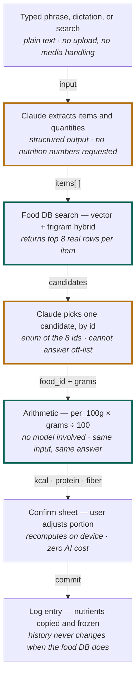

# AI Nutrition Tracker — Build Plan

**v3 · 11 weeks · daily calorie, protein and fiber tracker**

Locked decisions: React Native CLI (bare) · custom Node + Postgres API · Claude Opus 5 · text/voice + manual search + repeat · full daily tracker.
**Photo capture: parked, not cancelled.**

Published version: <https://claude.ai/code/artifact/d9110de2-3da1-4beb-89a7-74a36ea60a09>
Companions: [USER-FLOWS.md](./USER-FLOWS.md) · [BACKEND.md](./BACKEND.md)

---

## Contents

1. [The bet](#1-the-bet)
2. [The resolver pipeline](#2-the-resolver-pipeline)
3. [Stack](#3-stack)
4. [Data model](#4-data-model)
5. [Food database](#5-food-database)
6. [Portion accuracy](#6-portion-accuracy)
7. [AI cost model](#7-what-the-ai-actually-costs)
8. [Eval harness](#8-the-eval-harness)
9. [Goal math](#9-goal-math)
10. [Roadmap](#10-roadmap)
11. [Risks](#11-risks)
12. [Open questions](#12-open-questions)

---

## 1. The bet

People quit calorie trackers because logging is work. Language removes the work. But a model that invents nutrition numbers builds a product nobody can trust twice.

Every serious version of this app has to answer one question: when the screen says *612 kcal, 34 g protein, 7 g fiber*, where did those three numbers come from? If the answer is "the model said so," you have a demo. The numbers are unreproducible, unauditable, and quietly wrong in ways that compound across a week.

So the architecture splits the job. The model does what it is genuinely excellent at — turning *"two rotis, dal, and a bowl of curd"* into a structured list of foods and quantities, handling plurals, household units and vague amounts along the way. A real food-composition database does the part that must be exact. **Nutrition is arithmetic, not generation.**

> ### Photo capture is parked, not cancelled
>
> The camera route is out of v1. The architecture is unaffected — a photo was only ever a third front door onto the resolver in §2, producing the same `items[]` shape as a typed sentence. Adding it later is a new input adapter and a confirm-sheet state, not a re-architecture.
>
> Three things get materially better in the meantime, and they are reasons rather than consolation: **accuracy improves**, because portion estimation from pixels was the largest error source in the product (§6); **cost roughly halves**, because image tokens dominated the per-log bill (§7); and **the native surface shrinks**, which matters more than usual now that you own `ios/` and `android/` outright (§3).

---

## 2. The resolver pipeline

One path, three front doors. Typing, dictation and manual search all converge on the same resolver — so you build the hard part once, and the parked photo route plugs into it unchanged.



Legend: **amber** = model output · **teal** = your data and pure math.

The model never emits a nutrient value. It reads what you said and how much of it; identification is a constrained pick from real rows, and every number is a multiplication — so when a log comes out wrong, exactly one step is responsible.

Spoken input is dictation into the same text field, so it enters at step 2 identically. Manual search skips steps 2–4 entirely and enters at step 5. When photo returns, it becomes a fourth adapter producing the same `items[]` at step 2 — which is the whole reason this shape was chosen.

> **Why the constrained pick matters.** Step 4 looks redundant next to a plain vector search, and it is the step people cut. Don't. Embedding search reliably returns eight plausible rows and unreliably ranks them — "chicken, broiler, thigh, raw" and "chicken, thigh, fried, batter" sit close together and differ by 140 kcal. The model is very good at that final disambiguation and, because the schema restricts it to an enum of the eight ids, it cannot hallucinate a food that doesn't exist.

---

## 3. Stack

### Mobile — React Native CLI

Bare React Native with TypeScript. You own `ios/` and `android/` outright. Budget roughly a week of M0 and a standing maintenance line. With the camera out, the native surface is small enough that bare RN costs noticeably less to maintain.

| Need | Library | Note |
|---|---|---|
| Navigation | `@react-navigation/native` | Always the layer underneath Expo Router anyway |
| Local DB | `@op-engineering/op-sqlite` | The offline log queue. A log that fails on signal is a log they don't retry |
| Voice capture | `@react-native-voice/voice` | On-device dictation into the text field. Now the **only** native capture dependency |
| Secure storage | `react-native-keychain` | Session tokens only — no API key on the device to protect |
| Health data | `react-native-health`, `react-native-health-connect` | Weight and activity in M3 |
| Unchanged | TanStack Query, Reanimated, Gesture Handler, MMKV | None were ever Expo-specific |

**Removed with photo:** `react-native-vision-camera`, `@bam.tech/react-native-image-resizer`.

Two bare-RN specifics to settle in M0:

- **New Architecture** is on by default from RN 0.76 — vet every native dependency for Fabric and TurboModule support. A much shorter list now that VisionCamera and an image resizer are not on it.
- **RN version upgrades are yours** — each is a manual three-way merge of the native projects against the React Native Upgrade Helper diff. Plan one deliberately, early.

> **The two things Expo was actually doing for you**
>
> **Builds and signing.** No EAS means a macOS CI runner, Xcode toolchain, fastlane, provisioning profiles and an Android keystore, all owned by you. Pick a CI in week one and get a signed build onto a real device before any feature work — a broken signing setup discovered in M4 is a launch delay.
>
> **Over-the-air updates.** EAS Update is gone, and CodePush's hosted App Center service retired in 2025 — the remaining paths are self-hosting `code-push-server`, a commercial alternative, or accepting that every JS fix waits on app review. Decide in M0; retrofitting an OTA channel is much harder than starting with one.

### Backend

Node 22 + TypeScript on Fastify, Drizzle ORM, Postgres 16 with `pgvector` and `pg_trgm`, Redis for rate limits. Node over Python so a shared `@app/types` package puts the `items[]` contract under the compiler.

Two pieces of infrastructure come out with the camera:

- **No object storage** in v1 — nothing user-generated is large enough to need it.
- **No job queue** — a text parse plus a re-rank completes in about two seconds, so the whole resolver runs synchronously behind one request instead of a BullMQ round-trip and a polling endpoint.

Both come back with photo; neither is worth building now.

### AI

The official `@anthropic-ai/sdk` against `claude-opus-5` ($5 / $25 per million tokens in / out) for the parse and re-rank calls, with structured outputs via `output_config.format`. Adaptive thinking on, `effort` tuned down on the re-rank step.

**The API key never ships in the app.** Every AI call proxies through the backend — quotas, abuse limits, cost attribution and prompt versioning live there.

> **Prompt caching pays for itself here.** The food-taxonomy system prompt is long, identical on every request, and comes before the user's phrase. Put the stable prefix first and the volatile parts after the last cache breakpoint. Watch `usage.cache_read_input_tokens` — if it stays at zero you have a silent invalidator. Caching matters *more* now: with image tokens gone, the system prefix is most of the input on every call.

---

## 4. Data model

```
users, user_profiles      — age, sex, height, weight, activity, objective
goals                     — kcal/protein/fiber targets + effective_from

foods                     — canonical rows: USDA, OFF, your curated dishes
food_nutrients            — per 100 g, with a null-vs-zero distinction
food_portions             — "1 medium apple" → 182 g  (household units)
food_embeddings           — pgvector, for the step-3 search

log_entries               — user, timestamp, meal, source: text|voice|search|repeat
log_items                 — food_id, grams, AND a frozen copy of every nutrient

ai_runs                   — input hash, model, tokens, cost, latency, raw response
user_portions             — learned: "your bowl of dal" = 210 g
user_phrases              — "usual breakfast" → a saved multi-item meal
user_foods, recipes       — custom entries and saved meals
```

The `source` enum keeps a slot for `photo` from day one even though nothing writes it yet — an unused enum value costs nothing and a migration on a live logs table is never free.

### Freeze nutrients at commit

`log_items` stores the computed `kcal`, `protein_g`, `fiber_g` alongside `food_id`, rather than recomputing from `foods` on read. It looks like denormalization for speed; it is really about truth. USDA reissues data, you will re-ingest, and you will fix your own curated rows. If history is computed live, a Tuesday in March silently changes months later.

### Log every AI run

`ai_runs` costs an afternoon and answers questions you cannot otherwise answer: which prompt version regressed, what a heavy user costs, why one log came out wrong. It matters *more* without photo: the stored phrase **is** the reproducible input, so any bad log can be replayed exactly. It is also the raw material for the eval set in §8.

---

## 5. Food database

Self-host it. A per-call third-party nutrition API puts a marginal cost and a rate limit on your most common operation.

| Source | Covers | Why it's in the mix | Watch out |
|---|---|---|---|
| **USDA FDC** (Foundation + SR) | Whole, single-ingredient foods | Most reliable macro and fiber data available, public domain, bulk downloadable | US-centric; sparse on prepared dishes |
| **USDA FNDDS** | Prepared and mixed dishes | What people actually name out loud. Also the source of the household-unit portions §6 leans on | Portion conventions need mapping to yours |
| **Open Food Facts** | Packaged goods, global | Barcode-grade coverage no one else gives away | **ODbL licensed** — attribution and share-alike duties attach to the database. Get this in front of legal before launch |
| **Your dish table** | Regional + composite meals | The gap-filler you control; recipes that decompose into ingredients | Needs an ops loop |

Seed the curated table from real failures. Log every low-confidence match and every user correction, sort by frequency weekly, and enter the top misses. Two hundred well-chosen dishes will cover a startling share of logs.

One thing gets easier without photo: the miss log now stores the **exact words** a user typed when nothing matched. That is a far better ops queue than a photo of an unidentified plate — searchable, groupable, and it tells you what people *call* the food rather than what it looks like.

> ### The fiber trap — decide this before you build the schema
>
> Fiber is one of your three headline numbers and it is *null* on a large share of branded entries. The tempting default is to treat null as zero. Don't: it under-reports every single day, and invisibly.
>
> Give fiber three states — **known** (from the source), **imputed** (carried from a matched generic food, displayed with a `~`), and **unknown** (displayed as `—` and excluded from the day's denominator), so the ring reads "8 g of 28 g, 2 items unmeasured" instead of quietly lying. This changes the daily-ring component, which is why it is a schema decision, not a polish task.

---

## 6. Portion accuracy

This section used to open by calling portion estimation the accuracy ceiling of the product. **Dropping photo removes that ceiling** — and replaces it with a much smaller, much more tractable problem.

A model looking at a flat photo has no scale reference and no depth, and published evaluations of photo-based portion estimation generally land in the ±20–40% band. That error passed straight through the arithmetic into the day's total, and no amount of prompt tuning fixed it, because the information simply was not in the pixels.

Typed input does not have that problem, because **the user supplies the quantity**. What remains is a narrower question — how many grams is the user's *bowl*, *handful* or *slice* — and unlike a photo estimate, that question has a stable answer per person that gets better every time they correct it.

| What the user says | Error source | How it resolves |
|---|---|---|
| "180 g chicken" | None | Exact. Straight to arithmetic |
| "two rotis" | Per-unit weight | Near-exact once `food_portions` has a gram weight per unit |
| "a cup of rice" | Standard vs. actual cup | Standard household measure; small, well-characterised spread |
| "a bowl of dal" | Whose bowl? | The real remaining problem — solved per user by `user_portions` after one correction |
| "some nuts" | Genuinely unspecified | **Ask.** Don't guess a number the user never implied |

### What this changes in the build

- **Portion memory is promoted from mitigation to mechanism.** With photo it patched a model weakness; here it is the primary way vague units become numbers. Prefill from `user_portions` before the model ever sees the phrase.
- **Parse counts before you parse amounts.** "Two rotis" and "a bowl of dal" are different problems, and the schema should record which it got — a count, a standard measure, a personal unit, or nothing. That field drives the confirm sheet's behaviour.
- **Ask instead of guessing.** When the phrase specifies no amount, an unfilled portion chip is honest and takes one tap. A silently invented 100 g is the beginning of a wrong week.
- **Show ranges only where they're real.** A range on "180 g chicken" is noise. A range on "a bowl of dal" before you've learned their bowl is honest.

The net effect is worth stating plainly, because it is the strongest argument for shipping this order: **the v1 you are now building is more accurate than the v1 you were building last week**, and its remaining error shrinks with use rather than staying flat.

---

## 7. What the AI actually costs

Image tokens dominated the old bill. Without them, per-user spend roughly halves.

**Per text log**

| Component | Tokens | Note |
|---|---|---|
| System prefix (taxonomy, rules) | ~1–1.5k in | Identical every call — served from cache on nearly all of them |
| The user's phrase | ~30–60 in | Where image tokens used to sit |
| Parse + re-rank output | ~250–350 out | Items, quantities, chosen ids |
| **Total per log** | | **$0.010–0.015** at Opus 5 rates |

**Per active user / month** (3 logs/day)

| Scenario | AI-assisted logs | Was (with photo) | Now |
|---|---:|---:|---:|
| Naive — every log calls the model | 90 of 90 | ≈ $2.25 | ≈ $1.15 |
| **With one-tap repeats + caching** | ~36 of 90 | ≈ $0.70–0.90 | **≈ $0.45** |

The repeat list is still the biggest single lever, and it falls out of a feature you want anyway. Most people eat around twenty-five distinct foods. Once the frequent-and-recent list is good, the majority of logs become one tap. **The repeat list is simultaneously the retention feature and the margin.** Build it in M1, before any AI ships.

Further levers, each a real accuracy trade to make deliberately: Sonnet 5 ($2/$10) or Haiku 4.5 ($1/$5) — text parsing is far more forgiving than vision was, so the case for a cheaper tier is stronger than it used to be, but it still wants an eval run behind it; lower `effort` on the re-rank; Batch API at half price for nightly eval runs.

One number to watch: at roughly $0.45 a month, AI is no longer the dominant cost of serving a user. Postgres, storage and the macOS CI runner are now in the same conversation — a healthier place to be.

---

## 8. The eval harness

The workstream that separates a shipping product from a convincing demo — and one that just got dramatically cheaper to build.

The photo version of this section asked for 200–300 meals cooked, weighed and photographed. The text version needs no camera and no kitchen scale. You need **phrases paired with expected outputs**, and you can write the first two hundred at a desk in a couple of days.

**What the set contains**

- **Seed phrases** written by hand covering the hard cases: counts, plurals, vague units, brand names, regional dishes, multi-item sentences, misspellings, mixed languages, odd amounts ("half a tin").
- **Real phrases** harvested from `ai_runs` once M2 is live — the highest-value additions, because they are what users actually type rather than what you imagined.
- **Expected output** per phrase: item list, quantity and its type, correct `food_id`. Nutrients follow by arithmetic, so you don't label them separately.

**What you measure**

- **Item extraction F1** — did it find every food, and no phantom ones?
- **Quantity accuracy**, split by type — a missed count is a different bug from a mis-sized bowl
- **Top-1 food match** — isolates step 4 from everything else
- **MAPE on kcal, protein and fiber** — tracked separately because they fail differently

Run it nightly through the Batch API and **gate every prompt edit and model change on it**. Build it in M2 alongside the parsing route. It is also what makes the §7 question — whether a cheaper model tier is good enough — answerable with a number instead of an argument.

---

## 9. Goal math

| Target | Basis |
|---|---|
| BMR | Mifflin–St Jeor |
| TDEE | BMR × activity factor, 1.2 sedentary to 1.9 very active |
| Calories | TDEE ± 15–20% for a cut or bulk, **floored at BMR** |
| Protein | 1.6–2.2 g/kg bodyweight for active users; 0.8 g/kg floor |
| Fiber | 14 g per 1000 kcal, per the US Dietary Guidelines basis |

Recalculate on weight change, and write a new `goals` row with `effective_from` rather than updating in place — otherwise last month's "you hit your target" retroactively becomes a miss.

Ship the disclaimer: estimates are informational and not medical advice, and the app is not a medical device.

Privacy review is materially lighter without photo. There is no meal-photo retention policy to write, no camera permission to justify, and no risk of people, faces or homes ending up in your object storage. What remains is ordinary health-data handling — declare it, and state plainly that user data is not used for training.

---

## 10. Roadmap

Eleven weeks, assuming roughly two developers and design support. Two weeks came out with the camera.

| | Phase | Weeks | Contents |
|---|---|---|---|
| **M0** | Foundations | 1–3 | Monorepo, Fastify skeleton, auth. USDA and OFF ingestion into Postgres with embeddings. On mobile: signed iOS and Android builds on real devices, macOS CI runner, keystore and provisioning, New Architecture verified, OTA decision made. |
| **M1** | Manual logging and goals | 4–5 | Onboarding, TDEE and macro targets, food search, confirm sheet, today dashboard, recents/frequents list. *Fully usable with zero AI.* |
| **M2** | Text and voice logging + eval harness | 6–7 | The parsing route, the resolver, portion memory, and the eval set. *Now the only AI in the product* — so it gets the full two weeks rather than sharing them with a camera flow. |
| **M3** | History and insights | 8–9 | Day and week views, macro trends, streaks, weight via HealthKit and Health Connect, weekly summary. |
| **M4** | Hardening and launch | 10–11 | Offline queue, error and empty states, accessibility pass, store privacy declarations, quotas and abuse limits, beta cohort, submission. |

### Why manual still comes first

The resolver, the confirm sheet, the portion units and the freeze-at-commit rule are all shared with the parsing route — building them against typed search means debugging them without a model in the loop. By M2 the AI route is a new front door onto a path that already works, and the eval harness can prove it. When the AI is down or a user is out of quota, the app degrades to a competent manual tracker rather than a blank screen.

The same argument is why photo will be cheap to add later. It is one adapter, one sheet state, and the infrastructure it needs — object storage, a job queue — is deliberately absent rather than half-built.

---

## 11. Risks

Ordered by how likely they are to actually hurt you. The top of this list changed when the camera came out.

| Risk | What it costs | Mitigation |
|---|---|---|
| **Thin differentiation** | Text search plus macros is what every incumbent already ships. Without the camera, the wedge has to be parse quality, logging speed, and fiber as a first-class number | Be excellent at multi-item sentences — the thing search-based trackers genuinely cannot do (§10, M2) |
| **Day-7 churn** | The way logging apps normally die | One-tap repeats, sub-10s logs, streaks. Friction kills faster than inaccuracy |
| **Parse quality on real phrasing** | Now the only AI in the product, so a bad parse is a bad product | Eval harness in M2, seeded by hand and grown from real `ai_runs` (§8) |
| **Null fiber** | A headline metric silently under-reports every day — worse now that fiber is part of the differentiation | Three-state fiber and visible imputation (§5) |
| **Vague personal units** | "A bowl" means nothing until you've learned their bowl | Portion memory as primary mechanism; ask rather than guess (§6) |
| **Regional coverage** | Unusable outside the US, discovered post-launch | Curated dish table seeded from the miss log's actual phrases (§5) |
| **Build & signing pipeline** | Owned in-house now that EAS is out — breaks near submission | Signed builds on real devices in week 1, macOS CI from the start (§3) |
| **No OTA channel** | Every JS hotfix waits on app review | Decide in M0 — self-hosted CodePush or a commercial equivalent (§3) |
| **RN upgrade drift** | Native merges get skipped, then a security patch forces a painful jump | One deliberate upgrade early (§3) |

Two risks left this table entirely: **portion estimation from pixels**, which was previously first, and **meal-photo privacy handling**. Both return with the camera, and both should be re-read before that work starts rather than rediscovered.

---

## 12. Open questions

**Barcode scanning — worth reopening now.** It was a nice-to-have next to a camera that could read whole plates. With photo parked it is the only scan affordance in the product, the most accurate path for packaged food, free per scan, and Open Food Facts is already in the stack. Roughly three days in M1 — and it needs a camera permission you are otherwise not asking for, which is the real decision, not the effort.

**Which market first?** This decides whether the curated dish table is an M1 necessity or an M3 refinement. USDA alone is workable for a US launch and noticeably thin anywhere else — and it matters *more* for typed input, where users name dishes directly rather than showing you one.

**Free, subscription, or freemium?** The natural paid tier was photo logging. Without it, the boundary is less obvious — unlimited AI parsing versus a monthly cap, history depth, or insights. Decide before M1, because it shapes onboarding and gating.

**When does photo come back?** If the answer is "right after launch," a few M4 decisions change — keep the object-storage decision warm and the `photo` enum populated. If it's "maybe never," the confirm sheet can be simplified around known-quantity input and the multi-item flows get easier.

---

*Cost figures are estimates at current list pricing and should be re-checked against `count_tokens` once the real prompts exist.*
