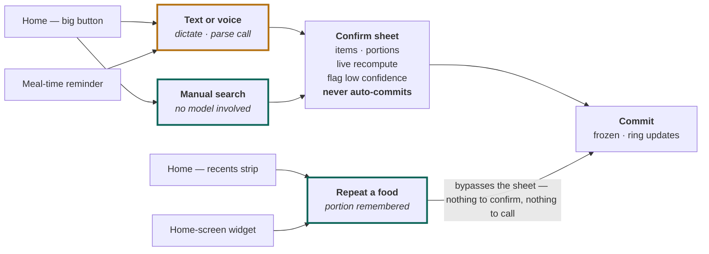

# User Flows

**v2 · companion to [PLAN.md](./PLAN.md) and [BACKEND.md](./BACKEND.md)**

Every screen, route and failure path in the tracker — organised around the one number that decides whether people keep using it: how long a log takes.

**Photo capture: parked, not cancelled.** §1 shows where it re-enters.

Published version: <https://claude.ai/code/artifact/e0fd055a-8f04-49bc-87d2-19e2a527be6f>

---

## Contents

1. [The map](#1-the-map)
2. [Onboarding](#2-onboarding)
3. [Time to log](#3-time-to-log)
4. [Repeat route](#4-repeat-route)
5. [Text and voice](#5-text-and-voice)
6. [Manual search](#6-manual-search)
7. [The confirm sheet](#7-the-confirm-sheet)
8. [Failure paths](#8-failure-paths)
9. [Permission choreography](#9-permission-choreography)
10. [Screen inventory](#10-screen-inventory)

---

## 1. The map

Four entry points, three routes, one confirm sheet, one commit. The only route that skips the sheet is the one most logs should take.

Legend: **amber** routes cost a model call · **teal** routes cost nothing.

The repeat route is the only one that reaches commit without a review step, which is exactly why it is both the cheapest path and the fastest one.

> **Where photo plugs back in.** When the camera route returns it becomes a fourth box in the ROUTES column and a share-sheet entry point on the left — everything to the right of it is already built. That is the payoff of routing all three current front doors through one resolver and one sheet: the flows in this document do not change when photo arrives, they only gain an entry.

---

## 2. Onboarding

Ninety seconds, and it ends on a number the user wanted rather than a permission dialog they didn't.

1. **Welcome** — one screen, one sentence about what the app does. No carousel.
2. **Account** — Sign in with Apple, Google, or email. Apple is mandatory on iOS if you offer any social login.
3. **About you** — sex, age, height, current weight. Four fields, sensible keyboards, metric/imperial toggle remembered.
4. **Activity level** — five plain-language options, not a multiplier. "Desk job, little exercise" beats "1.2×".
5. **Objective** — lose, maintain, or gain, plus a rate, floored so the calorie target can never fall below BMR.
6. **Your targets** — the payoff screen. Three numbers (calories, protein, fiber) with the reasoning visible and every one editable. Users who can see the math trust it and change it less.
7. **Log your first meal** — straight into search, *not* the composer. The first log should succeed with certainty, before you ask them to trust a parse.

> **What onboarding must not do.** No microphone permission, no notification permission, no health permission. Nothing here has earned them yet, and a cold prompt at step 2 is the most expensive dialog in the app — a denial is close to permanent. Permissions are asked at the moment of use; see §9.
>
> With the camera out of v1, this rule now costs you almost nothing: the app's first-run experience needs *no* system permission at all to be fully functional. That is a genuinely unusual position for a health app, and worth protecting.

---

## 3. Time to log

Measured on a **typical three-item meal**, because that is where the routes separate. One-item benchmarks hide the entire argument for parsing.

| Route | User input | Waiting on model | Confirm & commit | **Total** |
|---|---:|---:|---:|---:|
| Text or voice | 5.0s | 2.0s | 2.5s | **9.5s** |
| Manual search | 15.0s | — | 3.0s | **18.0s** |
| **Repeat a saved meal** | 1.5s | — | 0.5s | **2.0s** |

*Targets for a practised user on a good connection. Search is measured honestly: three items means three searches, three result lists and three portion picks.*

Three consequences, and they shape the product:

**Parsing earns its place on multi-item meals, not single foods.** For one apple, search is as fast and never wrong. For a plate with four things on it, search costs a minute of tapping and parsing costs a sentence. Design the composer around meals, not foods — and never benchmark the route on a single item, because that is the one case where it looks pointless.

**The home screen belongs to the repeat strip.** If the two-second route is buried one level down, users take an eighteen-second one and quietly conclude the app is tedious. Recents and frequents go above the fold, sized as real tap targets.

**Saved meals are the highest-leverage feature nobody asks for.** "Usual breakfast" collapses a three-item log into one tap. It is the same mechanism as the repeat strip, applied to a group, and it is what makes day 30 feel different from day 1.

---

## 4. Repeat route

Two seconds, no network round-trip, no model call. The most important flow in the app and the least interesting to build.

1. **Home** — recents strip shows the last dozen foods *and saved meals*, reordered by a frequency-and-recency blend and filtered by time of day.
2. **One tap** — logs immediately at the remembered portion from `user_portions`. No sheet, no confirmation dialog. A saved meal logs all of its items at once.
3. **Undo, not confirm** — a five-second undo toast replaces the confirm step. Cheaper for the 95% of taps that were right, fully recoverable for the rest.
4. **Long-press to adjust** — opens the confirm sheet at that item or meal for the times the portion was different.

> **Why skipping the sheet is right here — and only here.** Everywhere else the sheet exists to correct a model estimate. On this route there is no estimate: the food is one the user has logged before, at a portion they themselves set. There is nothing to check that they did not already tell you. Making them confirm it anyway is asking a question you know the answer to, four times a day.

---

## 5. Text and voice

The only AI route in v1, and the one the product is now judged on. Voice is not a separate flow — it is dictation into the same field.

1. **One field, natural phrasing** — "two rotis, dal and a bowl of curd". No structure, no per-item rows, no quantity pickers.
2. **Hold to dictate** — on-device speech into the same field, editable before sending. Falls back to server-side transcription where platform dictation is weak for the user's language.
3. **Read the sentence** — one model call returns the foods, the amounts and the nutrition. **[changed 2026-08-27]** This used to parse into items and then match each against the corpus. It no longer searches the corpus at all: it holds 25 Tamil aliases across 13,440 foods, so "rendu muttai and 5 dosai and chutney" matched almost nothing, and a dead end is worse for the user than an estimate they can see is an estimate. The cost is that the numbers are estimates — see docs/BACKEND.md §7.7 for what bounds that.
4. **Confirm** — same sheet, same commit as every other route, with a summary sentence and an estimate banner above the rows. About three seconds end to end.
5. **Save the phrase** — a sentence that worked is offered as a saved meal on its second use. "Usual breakfast" should be one tap by week two, which moves the user onto the two-second route permanently.

### What the composer has to get right

- **The wait is honest now.** **[changed 2026-08-27]** The sheet still opens immediately and echoes the phrase back, but the rows arrive together rather than filling in. The resolver streamed because its parse landed well before its database match, so partial rows were real information; one model call has no half-answer, and animating skeletons against nothing would be a progress bar for a process with no progress.
- **Never claim to have understood before you have.** The composer counted items by splitting on commas and *and* — which read "Rendu dosai chutney appuram sambar oothi sapten. So, how much..." as two, from the comma in *"So,"*. Three foods, none of them found. It sat above a button marked **Log it**. English punctuation cannot count Tamil items, and nothing splits the sentence until the model answers.
- **The speaker ends the turn.** Listening used to end only when an amplitude detector guessed the sentence had stopped; when it guessed wrong the only control was Cancel, which discards. A pause while reaching for the English word for a dish reads as an ending, and a kitchen with a television on never does. **Done** ends the turn and keeps what was said; the detector is the shortcut, not the only exit.
- **Keep the phrase on the entry.** It is the reproducible input for any later correction, the row in the miss log when nothing matched, and — unlike a photo — it is searchable and groupable when deciding which dishes to curate next.
- **Recent phrases, not just recent foods.** People re-say whole meals. Surfacing the sentence is a shortcut the food-level recents strip cannot offer.
- **Never invent an amount.** If the phrase said "some nuts", the quantity type is *none given* and the sheet asks. A silent 100 g is where a wrong week starts.

---

## 6. Manual search

The route with no model in it. It is the floor under everything else *and* the first log a new user ever makes, so it has to be genuinely good rather than a grudging fallback.

1. **Search** — trigram + vector over the same food table, with the user's own history and custom foods boosted above generic database rows.
2. **Results with the numbers visible** — calories and protein per standard portion in the result row, so choosing between four similar entries doesn't require opening each.
3. **Portion** — household-unit chips from `food_portions` first, custom grams behind them.
4. **Commit** — straight to commit; there is nothing estimated to confirm.

Every failed parse in §8 lands here, which means search quality caps how gracefully the app degrades. It ships in M1, before anything that can fail.

---

## 7. The confirm sheet

Where a parse becomes a user assertion. The product's credibility is decided in this component.

| State | What the user sees | Why |
|---|---|---|
| **Resolving** | Skeleton rows, sheet already interactive | Opens before results exist so a two-second wait reads as progress rather than a stall |
| **Confident** | Food name, portion chip, macro line, quiet styling | The common case should be reviewable in one glance and dismissable with one tap |
| **Quantity given** | Portion shown plainly — "2 rotis", "180 g" — with no range | The user stated it. Showing uncertainty on a number they supplied is noise |
| **Personal unit** | "a bowl" resolved from `user_portions`, or a prompt on first use | The one genuinely soft quantity type, and the one that gets permanently better after a single correction |
| **No amount given** | Empty portion chip, focused, waiting | "Some nuts" specifies nothing. Asking costs one tap; guessing costs trust |
| **Low confidence match** | Row flagged and expanded, runner-up candidates one tap away | Uncertainty surfaces where it can be fixed. A hidden bad match is a wrong number found a week later |
| **Unresolved** | The words that didn't match, with a scoped search field | Better to ask than to drop the item silently or invent a row for it |
| **Fiber unknown** | `—` rather than `0 g`, with a footnote and exclusion from the day's denominator | The §5 rule from the plan. Zero is a claim; unknown is the truth |
| **Committed** | Sheet dismisses, ring animates, delta shown: "+520 · 340 to go" | Closes the loop on why they logged at all |

**Three rules:**

- **Never auto-commit a parse.** Not on high confidence, not on a repeated phrase, not to win a second in the timing table.
- **Show ranges only where they are real.** A range on "180 g of chicken" is noise; a range on "a bowl of dal" before you have learned their bowl is honesty. The quantity type from §5 tells you which case you are in — this is the main reason that field exists.
- **Every correction is training data.** A portion edit writes to `user_portions`; a food swap writes to the miss log that feeds the curated dish backlog. The sheet is the app's main sensor, not just a form.

---

## 8. Failure paths

Every one ends in a logged meal or an explicit, recoverable stop. None ends in a spinner or lost input.

| When | What happens | Where the user lands |
|---|---|---|
| **Offline at send** | Phrase queued locally with the entry, parsed on reconnect | Log appears as pending; notified when its numbers arrive |
| **Model times out** | One silent retry, then stop | Search, with the phrase pre-filled into the query |
| **Nothing parsed** | Plain message — "we couldn't read that" | Search, phrase kept and pre-filled, miss logged |
| **Some items unresolved** | Read items stay; unaccounted words are listed, with a scoped search field | Confirm sheet, partially filled |
| **AI unavailable — no key, or the provider is down** | Distinct message from an unreadable sentence. Search still works, one food at a time | Search, with the phrase kept |
| **No amount in the phrase** | Quantity type recorded as *none given* | Confirm sheet with an empty, focused portion chip |
| **Dictation garbled** | Transcript shown before sending, always editable | The composer — a bad transcript is fixed by typing, never by re-recording |
| **Quota exhausted** | Stated plainly, with when it resets | Search and repeat still work — the app never fully stops |
| **No database match** | Miss recorded with the exact words used | Custom-food creation, two fields, reusable afterwards |
| **Commit fails** | Entry persists in the local queue and retries | Nothing to redo — the log is never lost to a network error |

> **The rule underneath all of these.** A user who typed a sentence has already done the work. Losing it — to a timeout, a dead connection, or an unparseable phrase — converts effort into nothing, and that is the failure that makes people delete a tracker. Every path above keeps the phrase attached to a real entry and degrades to a route that cannot fail.
>
> Text is more forgiving here than photo would have been: a failed parse leaves you holding the user's own words, which pre-fill the search box and read back as a sensible query. A failed photo left you holding an image nobody could use.

---

## 9. Permission choreography

Asked at the moment of value, never in a pre-flight block. With the camera out, v1 asks for almost nothing.

| Permission | Asked when | Framed as | If denied |
|---|---|---|---|
| **Microphone** | First hold of the dictate button | "To log by speaking" | Typing still works — same field, same route |
| **Speech recognition** | Alongside microphone, iOS only | Same prompt, same moment | Server-side transcription, or typing |
| **Notifications** | After the *first successful log*, not before | "Remind you at your usual meal times" | No reminders; nothing else changes |
| **Health / Health Connect** | First visit to insights, in M3 | "Pull your weight in so targets stay current" | Manual weight entry, which most users prefer anyway |
| **Camera** | *Not requested in v1.* Returns with photo logging — or earlier if barcode scanning ships, which is the real cost of that decision | | |

Each prompt is preceded by a one-line in-app explanation with a visible decline — the system dialog is asked only of users who already said yes to the plain-language version. That is what protects the permission you cannot ask for twice.

Worth noticing how short this table has become: a user can install the app, onboard, set goals, and log every meal by typing **without granting a single system permission**. Microphone is optional, notifications are optional, health is optional. That is a strong position for App Store review and an unusually clean privacy story — and it is the main thing barcode scanning would spend, since it needs the camera.

---

## 10. Screen inventory

| Milestone | Screens |
|---|---|
| **M1** | Welcome · Sign-in · Profile · Activity · Objective · Targets reveal · Home (ring, recents strip, meal list) · Search · Portion picker · Confirm sheet · Entry detail · Edit entry · Settings · Goal editor |
| **M2** | Composer · Dictation state · Transcript review · Skeleton sheet · Multi-item confirm · Low-confidence row · Unresolved-item row · Empty-portion prompt · Parse-failed fallback · Save-as-meal prompt · Quota-reached notice |
| **M3** | Day view · Week view · Macro trends · Weight entry & chart · Health permission priming · Weekly summary · Streaks |
| **M4** | Empty states for every list · Error states for every route · Offline banner · Account & data export · Delete account · Privacy and medical disclaimer |

Roughly forty screens including states — down from fifty with the camera flow removed. M1 still carries the largest single share, which is the shape you want: the milestone with no AI in it is the one that defines most of the app.

---

*Timings are targets for a practised user on a good connection, to be re-measured against the real pipeline in M2.*
